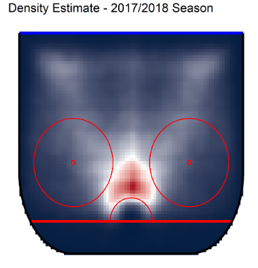
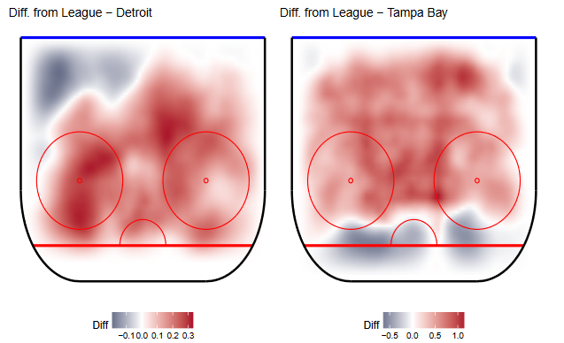

For any die-hard hockey fan, September 13th will be remembered as the day Erik Karlsson was traded by the Sens, and not without controversy, as it seems Ottawa got less for Karlsson than they gave to acquire Duchene earlier this year. It turns out that the 4th Annual Ottawa International Hockey Analytics Conference (OTTHAC18), again held at Carleton University, was scheduled on the following weekend (September 14th and 15th, 2018). We couldn't get there for the workshop and activities of Friday, but made the trip on Saturday to get a glimpse of what is going on in the hockey analytics community and, of course, hear what the folks in Ottawa thought about the most recent trade activity in the NHL. The day was packed with presentations, interviews and panels. Notable speakers and attendees were, among others, Rob Vollman (author of the book *Stat Shot*), Micah Blake McCurdy ([hockeyviz.com](hockeyviz.com)) and Elias Collette (consultant for the Ottawa Senators). You can see the full schedule by following this [link](http://statsportsconsulting.com/main/wp-content/uploads/OTTHAC18Schedule_0907.pdf). Here are the highlights of our day (in no particular order).

## What if Oscar Klefbom didn't get injured?

Tyrel Stokes' (McGill University) presentation, *Estimating the Causal Effect of Injury on Performance*, focused on the question: What would the world look like if someone wouldn't have gotten injured? And what are the consequences of getting injured? His prime example was Oscar Klefbom, who missed 52 games during the 2015-2016 season. Klefbom is a great example because he got injured during his second season in the NHL: if you compare Klefbom's stats from before and after his injury, it seems that he got better. The injury made him better? Of course not. Any serious analysis needs to take into account that Klefbom got older, stronger, more confident, and so on. It is interesting however to try to quantify the impact of Klefbom's injury on his progression? For the stats amateurs, the idea behind Tyrel's analysis is to model the progression of players using a random walk (with potential jumps). His conclusions are that injuries do indeed have a large short-term effect, but a small long-term effect. I guess that's a good thing!

Speaking of *what ifs*, what if Lemieux didn't get injured? Tyrel doesn't answer that question, but has lots to say about the comparison between Lemieux and Gretzky. If you're interested, check out his blog [Stats by Stokes](https://statsbystokes.wordpress.com).

## The rise of artificial intelligence

It's hard to have a conversation about AI in hockey (and sports in general) without mentionning the Montreal-based company SPORTLOGiQ. In their own words: "our software is able to transform raw video data into advanced sports analytics by flagging specific game events—shots, passes and possessions—and recording their XY coordinates."

We were happy to see that the sixth presentation of the day was given by someone, Campbell Weaver (Princeton University), who's building his own player tracking algorithm. He (or his algorithm) tracks the players' movements on the ice (from a broadcast video), using Keras and *deep convolution neural networks*. To circumvent the fact that it's hard to get a ton of labeled video (to teach the algorithm), he took advantage of the famous ImageNet dataset: in short, he first trained his algorithm to recognize everyday life things and only then began to teach him some hockey stuff. Why would this help?

<blockquote class="twitter-tweet" data-lang="en">
Campbell Weaver on transfer learning in hockey using ImageNet: &quot;the features of a person look a lot like a player and features of a person plus the features of a zebra look a lot like a referee&quot; 🤣🏒🥅🦓 <a href="https://twitter.com/hashtag/OTTHAC18?src=hash&amp;ref_src=twsrc%5Etfw">#OTTHAC18</a>
&mdash; D. David Yu (@yuorme) <a href="https://twitter.com/yuorme/status/1040992518232403968?ref_src=twsrc%5Etfw">September 15, 2018</a></blockquote>

Apart from the actual tracking of the players on the ice, Campbell also introduced us to the challenge that homography detection is: once we know where the players are, on the screen, how to place them a 2D representation of the ice (you know, the classic drawing of the ice on a board that coaches use).

Campbell's now beginning a master's degree in artificial intelligence, so there's no guarantee that he will find the time to advance his project as much as he would like in the next year or so, but check out his github repo https://github.com/ccweaver1/bsi_vision to see how the project is evolving.

## Speaking of SPORTLOGiQ...

There was one (or more) representative from SPORTLOGiQ, David Yu, who presented a very nice poster titled *Analysis of team level pace of play in hockey using spatio-temporal data*. None of us have seen a clearer analysis of the pace of play in hockey than this. Have a look for yourself...

<blockquote class="twitter-tweet" data-lang="en">
To wrap things up, here&#39;s my full poster for those interested and/or following at home. Curious what the broader <a href="https://twitter.com/hashtag/hockey?src=hash&amp;ref_src=twsrc%5Etfw">#hockey</a> <a href="https://twitter.com/hashtag/analytics?src=hash&amp;ref_src=twsrc%5Etfw">#analytics</a> community thinks of this work. <a href="https://twitter.com/hashtag/OTTHAC18?src=hash&amp;ref_src=twsrc%5Etfw">#OTTHAC18</a> 🏒🥅 <a href="https://twitter.com/SPORTLOGiQ?ref_src=twsrc%5Etfw">@SPORTLOGiQ</a> <a href="https://t.co/Bs24woHPZJ">pic.twitter.com/Bs24woHPZJ</a>
&mdash; D. David Yu (@yuorme) <a href="https://twitter.com/yuorme/status/1041381948344557568?ref_src=twsrc%5Etfw">September 16, 2018</a></blockquote>

## Hockey in space

One thing we'll remember from Devan Becker's (University of Western Ontario) presentation, *Hockey in Space: Characterizing team-wise differences in shot locations with spatial point processes*, is that there is more and more data available from NHL APIs. For each team individually, Devan got the locations of the shots taken, which he smoothed using a parametric model (Log-Gaussian Cox Process). For example, when we average over all shots taken, we get the density heatmap just beside this paragraph. To tell how much a given team deviates from the average, Devan repeated the process that particular team (only their shots taken) and subtracted the heatmap obtained to the league average. We can then compare teams by placing their corresponding heatmaps side-by-side. Here's the comparison between the Wings and the Lightning.

To make your own comparisons, check out his very nice [Shiny app](https://dbecker.shinyapps.io/LGCP_Results/) (built using the more-than-cool R package [Shiny](https://shiny.rstudio.com/)). To get the deviation from league average, choose the option S(x,y) in the Data scrolling menu. A nice viz tool, useful to get some quick insights about other teams tendencies, strategies, weaknesses, etc. Interesting! :clap: :clap:

## Malkin vs McDavid

In the new age of data, it's all about context! Indeed, we can now analyze the basic statistics collected such as shots, goals, assists, etc, focusing on very specific contexts. The idea of normalizing with respect to context was the basis of Micah Black McCurdy's talk: [Isolating Individual Skater Impact on Team Shot Quantity and Quality](http://hockeyviz.com/static/pdf/otthac18.pdf).

To illustrate the idea, imagine you want to compare Evegni Malkin and Connor McDavid. The former had 1.21 pts/games in the last 2 NHL seasons while the latter had 1.27. Not a large difference... but when you start to compare the different contexts in which the two players play, you are forced to notice that they have very different linemates, and teammates; they do not face the same kinds of players during their games. Could normalizing for these different factors tell us an alternative story about Malkin vs McDavid? Micah proposed to characterize the contexts in which the players are put using criteria such as:

- teammates: playing with good players or not?
- competition (opposing players): playing against good players or not?
- score impact: playing in a team that always trail or not?
- zone impact: playing most of his time in offensive or defensive zones?

We won't go into the technical details of his method; you can find them by following the (above) link to his presentation. We also strongly encourage you to take a glimpse at his results (slides 22-23 and 32-37). You may be surprised to see that Brendan Gallagher is rated quite well, and that Sidney Crosby is not the best 5v5 net performer in the league (according to the metric!)... :anguished: :anguished: :anguished: 

## Final word

Of course, this was just a small part of what happened on Saturday, and we're sorry we couldn't summarize it all because most of it was pretty interesting. Omitted (but still worthy!) presentations treated the questions of how to best qualify/quantify the pace of play (Tim Swartz); how to identify exceptional players (Yejia Liu, Simon Fraser University); concussions and dementia (Lili Hazrati, The Hospital for Sick Children); and the hot hand theory in hockey (Likang Ding). 

Other posters, which were all very original, were about improving the plus/minus statistic (Seongwon Im, we think this is a great idea); applying the Elo ratings from chess to hockey (Roman Parparov); the effect of aging on the players' performances, as well as the effect of end-of-contract (Kyle Stich); and finally, creating 3D models for the distribution of shot locations (University of Toronto Hockey Analytics Club).

All slides and posters are available [here](http://statsportsconsulting.com/otthac18/).

There were also multiple panels/interviews with hockey experts. This is where the Karlsson saga popped all the time. Panelists/experts that identified themselves as Sens fans appeared quite disappointed (to say the least), but most of them seemed to agree on one thing: it's time for a rebuilding phase in Ottawa: invest in young players and show patience. The only problem is that Ottawa gave away their first-round pick for the 2019 draft in the Duchesne trade (to Colorado). Chances are that Joe Sakic was smiling when he heard about the Karlsson trade...

