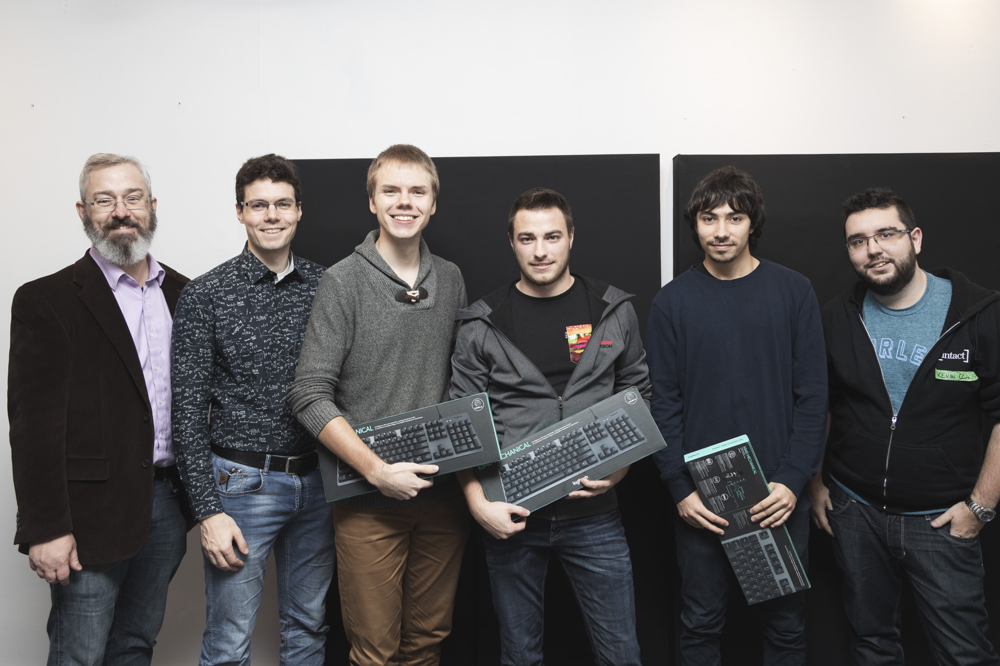
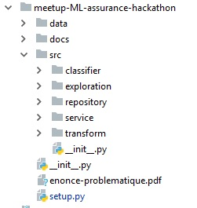
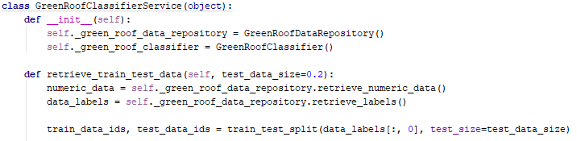
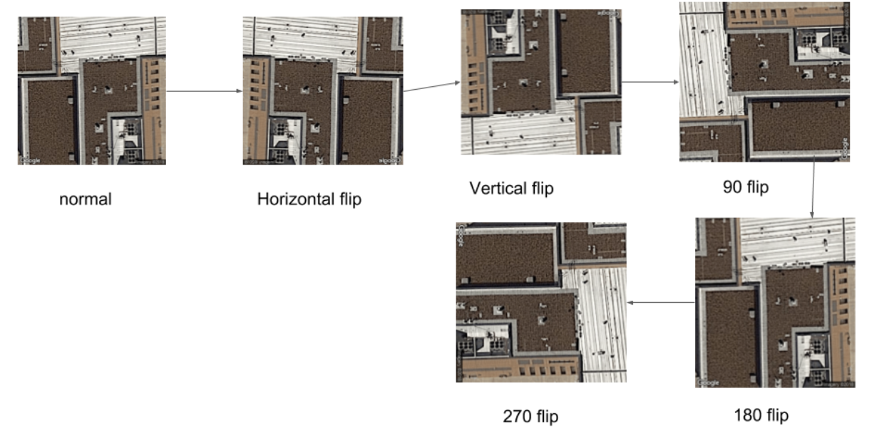

Le 10 novembre 2018 avait lieu à Québec la [Journée hackathon en assurance](https://www.facebook.com/events/185652975580020/), organisée par [MeetupMLQuebec](https://www.facebook.com/MeetupMLQuebec) et présentée en collaboration par Intact Assurances et Co-operators.

Félicitations à *Last but not furious*, gagnants du prix *Linus Torvalds*, remis à l'équipe qui a remis le code de meilleure qualité. Les juges avaient notamment à l'oeil les critères suivants:

- La structure générale du projet
- L'indentation utilisée dans les programmes
- Le choix des noms utilisés pour les fonctions, les variables, les méthodes et les classes
- La constance dans le style de programmation
- L'utilisation adéquate de commentaires

Pour plus de détails sur la problématique ou l'énoncé, rendez-vous sur le [dépôt officiel](https://github.com/dot-layer/meetup-ML-assurance-hackathon) de la compétition.

Nous nous sommes entretenus avec Alex St-Jean, Marc-Alexandre Paquet et Taha Racicot, membres de l'équipe gagnante, que l'on voit ci-haut sur la droite, accompagnés des juges.

#### Q: Commençons par discuter de votre expérience globale. Quelles sont vos premières impressions à propos de la Journée hackathon?

R: Certains d'entre nous avions déjà participé à des compétitions dans le même genre, mais nous avons bien aimé le côté détendu de la journée. L'ambiance collaborative favorisait l'entraide et le plaisir plutôt que la compétition et le stress. En bout de ligne, c'est quelque chose que nous avons beaucoup apprécié de la journée.

#### Q: Discutons maintenant de ce qui vous a fait gagner le prix : la qualité de votre code. Quels principes de base ont guidés le design de votre code?

R: Nous nous sommes principalement concentrés sur des noms de variables représentatifs, sur une indentation constante, mais surtout sur la structure du projet et sa maintenabilité. 
Les *SOLID principles*, l'architecture en couche, ainsi que les principes provenant de [*Clean Code*](https://www.oreilly.com/library/view/clean-code/9780136083238/) ont été nos règles de base. 
Cependant, le manque de standards dans les structures de projets de *data science* nous rendait la tâche plus difficile, mais nous avons suivi notre intuition de ce côté-là.

#### Q: Pouvez-vous nous partager les meilleurs extraits de votre solution?

R: Voici de quelle façon nous avons bâtit la structure générale de notre projet: 

De cette manière, nous croyons avoir bien séparé les différentes composantes de notre modèle. Aussi, voici un exemple de classe que nous avons créée pour encoder notre classifieur:

#### Q: Mettons de côté la qualité du code. De quelle manière avez-vous attaqué la problématique à résoudre?

R: On a commencé par faire une analyse des données brutes en déterminant les *features* les plus importantes. Ensuite, nous avons séparé les données en jeux de données d'entraînement et de tests avec une proportion 80/20. Nous avons d'abord tenté le coup avec une régression logistique. Cela nous a donné un rappel d’un peu plus que 65% pour les toits verts, ce qui n'était pas optimal à nous yeux. Ainsi, nous avons tenté d’améliorer nos données. Nous avions remarqué un débalancement des classes à prédire dans le jeu de données, alors nous avons fait une augmentation des données en faisant rotationner les images:

Avec ces données augmentées, la proportion de toits verts était d'environ 50%, au lieu du 20% initial. Nous avons par la suite recréé les *features* pour ce nouveau jeu de données avec le modèle *ResNet50*. Ce pré-traitement sur les données nous a permis d’atteindre un rappel de près de 80% pour les toits verts, ce qui était plus satisfaisant pour nous en termes de performances.

#### Q: Que conseillez-vous aux gens qui veulent commencer à participer à des hackathons?

R: Nous leur conseillons surtout de ne pas avoir peur de "perdre". L'expérience en soi est une victoire. De plus, il est important de bien lire l'énoncé et de bien allouer son temps pour finaliser son projet. C'est bien de passer du temps sur son algorithme pour avoir de meilleures performances, mais au final avoir un produit reproductible et bien construit a beaucoup plus de valeur à nos yeux. 

#### Q: Quel est le background des membres de l'équipe? Croyez-vous que ce background vous favorisait dans la catégorie *Linus Torvalds*?

R: Deux d'entres nous avons un parcours scolaire relié à l'informatique alors que le 3ème membre à étudié en administration des affaires. Nous ne pensons pas que nos backgrounds nous favorisaient en termes de *Machine Learning*, puisque le domaine est en quelque sorte un mélange d'informatique et de mathématiques. Toutefois, notre expérience en programmation nous a bien servis pour la catégorie de prix que nous avons gagnée.

#### Q: Aviez-vous ciblé la catégorie de prix *Linus Torvalds* volontairement durant la compétition?

R: Oui, sans aucun doute. Sachant que les critères d'évaluation n'incluaient pas explicitement la performance de l'algorithme, nous avions en tête de remettre la meilleure qualité du code possible. Ce n'est pas seulement pour le prix, nous considérons que c'est un point très important dans n'importe quel projet de programmation. Nous savions également que nous avions de l'expérience pour nous démarquer de ce côté.

#### Q: De quelle façon votre équipe a-t-elle alloué les 6 heures à sa disposition? Avec du recul, les auriez-vous allouées de façon différente?

R: Nous avons divisé nos forces en trois, travaillant sur la même tâche pendant 6h! Marc-Alexandre s'occupait de l'approche utilisant des images pour les classifier. De mon côté (Alex), j'utilisais les données structurées pour classifier les images. Taha nous assistait dans nos démarches, dans la transformation des données, ainsi que dans la présentation. Ceci a permis une utilisation optimale de notre temps.

#### Q: Quels ouvrages conseillez-vous aux gens qui veulent améliorer leurs présentations? Et leur performance dans la résolution de ce genre de problématiques?

R: Comme ouvrage, nous recommandons définitivement  [*Clean Code*](https://www.oreilly.com/library/view/clean-code/9780136083238/) et [Clean Architecture](http://blog.cleancoder.com/uncle-bob/2012/08/13/the-clean-architecture.html) d'Uncle Bob, ainsi que [GOOS](http://www.growing-object-oriented-software.com/) (Growing Object-Oriented Software Guided by Tests). 

Nous recommandons également aux étudiants de l'Université Laval de suivre le cours [GLO-4002](https://www.ulaval.ca/les-etudes/cours/repertoire/detailsCours/glo-4002-qualite-et-metriques-du-logiciel.html) (Qualité et métriques du logiciel). C'est l'un des cours les plus formateurs (offerts à ULaval) pour avoir des bases solides en programmation.

Pour améliorer les performances dans la résolution de problèmes de *Machine Learning*, nous recommandons [Data mining : concepts and techniques](http://myweb.sabanciuniv.edu/rdehkharghani/files/2016/02/The-Morgan-Kaufmann-Series-in-Data-Management-Systems-Jiawei-Han-Micheline-Kamber-Jian-Pei-Data-Mining.-Concepts-and-Techniques-3rd-Edition-Morgan-Kaufmann-2011.pdf) de Jiawei Han, [The Elements of Statistical Learning](https://web.stanford.edu/~hastie/Papers/ESLII.pdf) de Hastie et [Hands-On Machine Learning with Scikit-Learn and TensorFlow](http://index-of.es/Varios-2/Hands%20on%20Machine%20Learning%20with%20Scikit%20Learn%20and%20Tensorflow.pdf) d'Aurélien Géron.

#### Q: Est-ce que le hackathon a changé vos plans (études, participations à d'autres événements, cours en ligne, etc.) pour les prochains mois? Quelles sont les prochaines étapes pour vous?

Voici leur réponse:

**M-A**: De mon côté, j'ai commencé à en apprendre plus sur le *Machine Learning* l'été passé. Pour le moment, je travaille dans une entreprise où on essaye de voir ce qu'il est possible de faire en recherche appliquée de ce côté et comment on peut tirer notre épingle du jeu dans ce champ d'expertise. L'événement me permet de continuer dans cette veine.

**A**: Pour ma part, le hackathon m'a donné le goût de participer à d'autres événements similaires. Initialement j'étais vraiment stressé de ne pas bien performer, mais en voyant ça plus comme une situation d'apprentissage qu'une compétition, ça devenait beaucoup moins stressant.

**T**: Pour ma part, la journée n'a pas vraiment changé mes plans pour les prochaines années.

Merci pour votre participation, encore une fois félicitations, et rendez-vous au prochain événement de [MeetupMLQuebec](https://www.facebook.com/MeetupMLQuebec)!

**La qualité des photos vous impressionne? Rendez-vous sur le site de [Pikur](http://www.pikur.ca) pour d'autres projets tout aussi fascinants.**
