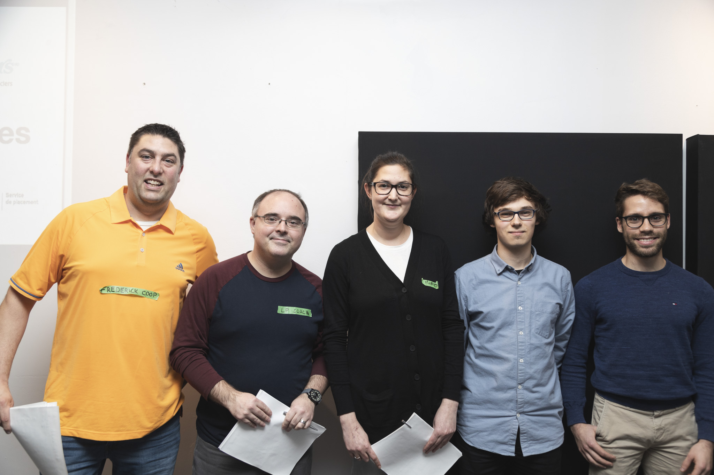

Le 10 novembre 2018 avait lieu à Québec la [Journée hackathon en assurance](https://www.facebook.com/events/185652975580020/), organisée par [MeetupMLQuebec](https://www.facebook.com/MeetupMLQuebec) et présentée en collaboration par Intact Assurances et Co-operators.

Félicitations à *La revanche du perceptron*, gagnants du prix Martin Luther King Jr., remis à l'équipe qui a réalisé la meilleure présentation. Le tout, en respectant la limite de temps de 2 minutes. Les juges avaient notamment à l'oeil des critères tels que la clarté des propos et l'efficacité à présenter la méthodologie et les résultats. Pour plus de détails sur la problématique ou l'énoncé, rendez-vous sur le [dépôt officiel](https://github.com/dot-layer/meetup-ML-assurance-hackathon) de la compétition.

Nous nous sommes entretenus avec Simon Bellemare et Étienne Buteau, membres de l'équipe gagnante, que l'on voit ci-haut sur la droite, accompagnés des juges.

#### Q: Commençons par discuter de votre expérience globale. Quelles sont vos premières impressions à propos de la Journée hackathon?

R: Tout d'abord, c'était notre premier hackathon en tant qu'équipe, donc nous avons appris énormément. C'était aussi notre première expérience avec une librairie de Deep Learning (Keras) et avec une machine virtuelle Amazon. Nous avons dû nous adapter rapidement à ces nouveaux outils. Cela dit, bien que 6 heures peuvent paraître beaucoup, nous avons en fait été très serrés dans le temps.

#### Q: Discutons maintenant de ce qui vous a fait gagner le prix : votre présentation. Le temps limite était de 2 minutes, donc vous deviez être efficaces. Quel est le moment clé où vous pensez que vous avez réussi à convaincre les juges?

R: Nous croyons que la démonstration de la méthode utilisée est ce qui a charmé les juges. Nous avons utilisé une technique très semblable à ce qui est utilisé actuellement dans l'industrie et nous avons réussi à résumer clairement et efficacement cette méthode. Nous étions les seuls à entraîner les couches convolutives du réseau ResNet50 sur le jeu de données disponible pour résoudre la problématique. Contrairement aux autres équipes qui ont utilisé directement les *features* fournies pour les analyser avec un algorithme de classification classique, nous avons plutôt ré-entraîné le réseau ResNet50 pour extraire les nôtres. Nous avons mis l'accent sur ce point et avons construit la présentation autour de celui-ci.

#### Q: Pouvez-vous nous partager cette technique avec des extraits de votre présentation?

R: En résumé, nous sommes partis d'un modèle existant pour bénéficier des poids appris par ce dernier. Nous l'avons ensuite modifié pour qu'il soit mieux adapté à la problématique à résoudre. Puis, nous l'avons ré-entraîné à l'aide des données de toits fournies.

Pour expliquer le réseau et présenter notre méthode, nous avons présenté aux juges l'image suivante, tirée de [cet article](https://www.groundai.com/media/arxiv_projects/23387/) :

Pour les plus curieux, voici les détails de notre solution :  

ResNet50 est un réseau pré-entraîné dans le cadre de la compétition [ImageNet](https://www.quora.com/What-is-the-ImageNet-competition) sur des millions d'images.  Cependant, l'objectif de ce réseau est de discriminer 1000 classes d'objets. Dans notre cas, nous n'en avions que 2 à discriminer : toit vert, ou non. Nous avons donc remplacé la couche de sortie originale par une neurone de sortie sigmoïde, donnant une interprétation probabiliste de notre résultat. De cette façon, on peut prédire avec la couche de sortie du réseau la probabilité que l'image a d’appartenir à chacune des 2 classes, selon les informations qu'a réussi à collecter le réseau de neurones en entraînement. Nous avons également ajouté quelques couches cachées avant la couche de sortie.

Pour ce qui est de l'entraînement, notre système permettait 
d'entraîner d'abord les couches cachées ajoutées. Puis, un autre entraînement, incluant trois des couches de convolution du réseau ResNet, était effectué. Ce dernier permettait de personnaliser les *features*
extraites par le réseau en fonction des résultats obtenus en sortie. En effet, le réseau ResNet50 n'a pas été entraîné spécifiquement pour extraire des *features* relatives à des images de toits, étant donné que les images et classes de ImageNet sont bien plus variées. C'est ainsi que nous nous distinguions principalement, soit en obtenant des *features* personnalisées au problème permettant donc une décision plus optimale. Tout ça se faisait en un temps
d'entraînement relativement court, car on ne réentraînait que 3 couches de ResNet.

Finalement, nous avons aussi divisé notre jeu de données en un jeu d'entraînement et un jeu de validation. Cela nous permettait d'obtenir un jeu pour entraîner notre réseau et un autre pour obtenir une idée de nos performances en généralisation (avec des données pour lesquelles le réseau n'était pas entraîné). Nous avons cependant manqué de temps et n'avons eu le temps de tester notre réseau qu'avec une neurone sigmoïde en sortie et 5 époques d'entraînement.

#### Q: Votre technique s'est évidemment distinguée de celles des autres équipes. Qu'en est-il de votre méthode de travail?

R: Nous avons utilisé une méthode de programmation que nous appelons *co-programming*. Un programme, pendant que l'autre fournit des conseils et cherche dans la documentation des librairies. Nous interchangions fréquemment ces rôles. Pour plus de détails, vous pouvez consulter la [page Wikipédia](https://fr.wikipedia.org/wiki/Programmation_en_bin%C3%B4me) dédiée à ce sujet.

#### Q: Quel est votre *background* ? Croyez-vous que cela vous favorisait dans la catégorie Martin Luther King Jr.?

R: Nous sommes tous les deux étudiants au baccalauréat en génie électrique. Nous ne pensons pas que notre *background* nous favorisait particulièrement dans cette catégorie, car nous n'avons pas souvent à faire des présentations devant un auditoire.

#### Q: Aviez-vous ciblé la catégorie de prix Martin Luther King Jr. avant ou pendant la compétition en faisant des compromis sur les autres prix (créativité, code) ?

R: Non. Pour être bien honnête, nous avons été très surpris par notre victoire, car le niveau des autres équipes était très élevé. 

#### Q: De quelle façon votre équipe a-t-elle alloué les 6 heures à sa disposition? Avec du recul, les auriez-vous allouées de façon différente?

R: Nous avons commencé par choisir la méthode à implémenter pour résoudre le problème ainsi que la librairie *Python* à utiliser pendant environ une heure. Ensuite, nous avons passé environ deux heures pour nous familiariser avec la librairie Keras, car nous n'avions pas d'expérience avec l'apprentissage profond en *Python*. Le reste de la journée a été utilisé pour implémenter la solution. En parallèle, Étienne a commencé la présentation lors de la dernière heure. Nous croyons que notre utilisation du temps était correcte.

Si c'était à refaire, nous utiliserions une autre librairie, car nous avons perdu énormément de temps à reformater les données et à essayer de faire fonctionner notre solution. Également, nous aurions peut-être dû tester les librairies à utiliser d'avance, car nous avons eu beaucoup de problèmes avec le formatage des données.

Concernant la complexité de la solution, par manque de temps, il ne nous a pas été possible d'étendre la sortie du réseau à plusieurs couches cachées non convolutives. D'ailleurs, heureusement que nous avions des cartes graphiques à notre disposition pour accélérer l'entraînement.

#### Q: Que conseillez-vous aux gens qui veulent commencer à participer à des compétitions de ce genre?

R: Ne soyez pas effrayés par l'ampleur de la tâche. L'important est de séparer le problème en petites étapes et d'approcher l'événement comme une occasion d'apprendre sur un sujet. Si la compétition est très courte comme celle-ci : se préparer, se renseigner sur le sujet d'intérêt et se pratiquer avec les outils de programmation avant la journée de la compétition. Le faire nous aurait permis d'obtenir des résultats beaucoup plus convaincants.

#### Q: Quels ouvrages conseillez-vous aux gens qui veulent améliorer leurs présentations? Et leur performance dans la résolution de ce genre de problématiques?

R: Nous conseillons les ouvrages suivants:

- L'excellent [Comment se faire des amis et influencer les autres](http://www.editions-homme.com/comment-se-faire-amis-influencer-autres-nouvelle-edition/dale-carnegie/livre/9782764010310) de Dale Carnegie propose des moyens efficaces de construire une présentation claire qui saura convaincre un auditoire.
- En ce qui concerne la résolution de problème, [How to Solve It](https://press.princeton.edu/titles/669.html) de George Pólya présente une méthode générale pour résoudre des problèmes de type mathématique.
- Pour le *Machine Learning* en général, [Introduction to Machine Learning](https://mitpress.mit.edu/books/introduction-machine-learning), écrit par Ethem Alpaydin au MIT Press.
- Finalement, [Deep Learning](https://www.deeplearningbook.org/) est la référence en matière de réseau de neurones.  

#### Q: Est-ce que le hackathon a changé vos plans (études, participations à d'autres événements, cours en ligne, etc.) pour les prochains mois? Quelles sont les prochaines étapes pour vous?

R: Voici leur réponse:

**É** : C'était ma première participation à un événement de ce genre et j'ai apprécié mon expérience. Je compte bien répéter l'expérience! Il me reste 1 an à mon baccalauréat et je compte faire une maîtrise, probablement en traitement du signal ou en intelligence artificielle appliquée à la robotique.

**S** : Oui, il a définitivement contribué à augmenter mon intérêt pour l'intelligence artificielle.

Merci pour votre participation, encore une fois félicitations, et rendez-vous au prochain événement de [MeetupMLQuebec](https://www.facebook.com/MeetupMLQuebec)!

**La qualité des photos vous impressionne? Rendez-vous sur le site de [Pikur](http://www.pikur.ca) pour d'autres projets tout aussi fascinants**
