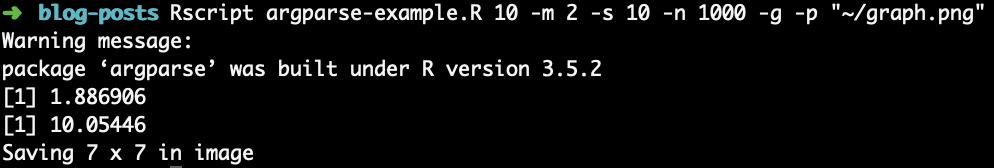

```{r setup, include=FALSE}
knitr::opts_chunk$set(echo = TRUE, message = FALSE, warning = FALSE)
```

Dans les derniers mois, j'ai été confronté à 2 défis qui m'ont éventuellement permis de découvrir un package R et une manière de programmer qui m'étaient auparavant inconnus. Dans un premier temps, je devais intégrer l'appel de programmes R à l'intérieur d'un *shell script* (un fichier avec l'extension `.sh`) dans lequel je devais passer différents arguments qui allaient être utilisés par le programme. Dans un deuxième temps, je devais lancer un programme R, avec différents paramètres, à l'aide d'une instance *Amazon Web Services (AWS)*, pour laquelle je n'avais pas d'interface graphique. Dans les deux cas, je devais faire l'appel d'un programme R à partir de la ligne de commande, ce qui est d'ailleurs possible avec la commande `Rscript`. Par contre, je devais également passer des arguments à ce programme lors de l'appel à la ligne de commande. C'est à ce moment que j'ai fais la découverte du package [argparse](https://cran.r-project.org/web/packages/argparse/index.html), un outil méconnu par plusieurs et qui offre des fonctionnalités intéressantes.

# `argparse` et la ligne de commande

Comme vous l'avez probablement deviné dans l'introduction, `argparse` est un package R qui permet de faciliter l'appel de programmes R à partir de la ligne de commande. Pour être plus précis, `argparse` est un package qui permet de créer une interface de ligne de commande (ou *command line interface* ou *CLI*). Cette interface agit en quelque sorte de pont (ou moyen de communication) entre l'appel d'un programme via la ligne de commande et les opérations effectuées à l'intérieur de ce programme.

Pourquoi appeler un programme R de la ligne de commande alors qu'on peut le lancer directement de la majorité des *IDE* comme RStudio ou même à partir de R directement? Il y a plusieurs exemples qui pourraient être cités, les deux exemples mentionnés en introduction sont pour moi des applications courantes, surtout lorsqu'on doit utiliser des ressources en ligne comme des instances *AWS* pour plus de puissance de calculs. Ces instances sont souvent dépourvues d'interface graphique, ce qui fait en sorte que nous nous retrouvons souvent devant le terrifiant écran noir du terminal.

# Fonctionnement

Le package R `argparse` est en fait un *wrapper* à la librairie Python du même nom. De plus, il existe d'autres packages R, comme [optparse](https://cran.r-project.org/web/packages/optparse/index.html), qui fonctionnent de manière similaire. L'objectif de cet article n'est pas de vanter un package plus d'un autre, mais plutôt d'illustrer le concept général en utilisant comme exemple le package `argparse`. La création d'une interface de ligne de commande avec ce package est très simple, les étapes sont généralement :

1. Définir les arguments pouvant être appelés de la ligne de commande
2. Parser les arguments et les stocker dans un objet (habituellement une liste)
3. Utiliser les éléments ce cette liste dans le programme

Les étapes 2 et 3 sont sont assez simples à réaliser. L'étape la plus cruciale est de bien définir les arguments (étape 1). Pour se faire, il y a quelques considérations à prendre en compte. Les prochaines sections vont permettre de mieux définir ces considérations.

## Initialiser l'objet `Parser`

Tout d'abord, avant même de définir les arguments, il faut attacher le package `argparse` et initialiser l'objet de type `Parser`. Nous pourrons ensuite ajouter des arguments à cet objet dans les prochaines sections.

```{r}
library(argparse)
parser <- ArgumentParser(description = "Simuler des distributions normales")
```

## Nommer les arguments

Maintenant que l'objet `Parser` est défini, il faut définir et nommer les arguments qui pourront être appelés à la ligne de commande. Pour ajouter ces arguments à notre objet, on utilise la méthode `add_argument()`. Il existe deux sortes d'arguments: les argument positionnels et les arguments optionnels. Dans le premier cas, ces arguments sont obligatoires et doivent être appelés dans un ordre précis alors que dans le deuxième cas, ils sont facultatifs et peuvent être appelés dans n'importe quel ordre, tant qu'ils sont nommés dans l'appel. Voici un exemple simple d'ajout de ces 2 sortes d'arguments:

```{r}
parser$add_argument("n_dist", type = "integer")
parser$add_argument("-m", "--mean", type = "double", default = 0)
```

Les arguments optionnels sont généralement identifiés par le préfixe `-` alors que les autres seront considérés comme positionnels. L'option `required` permet également de spécifier les arguments qui ne peuvent pas être omis lors de l'appel. 

Il est possible de spécifier le type de valeur de l'argument grâce à l'option `type` qui peut prendre les types suivants:

- "double"
- "character"
- "logical"
- "integer"

Les arguments optionnels doivent être accompagnés d'une valeur par défaut. Notez que les arguments optionnels sont parfois nommés de 2 manières, avec un seul trait d'union (`-m`) pour l'abréviation courte et deux (`--mean`) pour le nom complet. Il n'est pas obligatoire de mettre les deux, mais cela peut améliorer la clarté de l'appel.

## Définir l'aide

Une fonctionnalité intéressante avec les interfaces de ligne de commande comme celle du package `argparse` est que l'on peut généralement définir une aide pour l'appel de chaque argument pouvant être appelé par le programme. Cela permet de documenter un programme en résumant son objectif et en résumant son mode d'usage. Cette aide peut être affichée en appelant l'argument `-h` ou `--help` au programme. Par exemple, 

```{r}
parser <- ArgumentParser(description = "Simuler des distributions normales")
parser$add_argument("n_dist", type = "integer",
                    help = "nombre de distributions simulées")
parser$add_argument("-m", "--mean", type = "double", default = 0,
                    help = "moyenne pour chaque distribution normale [défault: %(default)s]")
parser$print_help()
```

Notez que la valeur par défaut peut être incorporée dans l'aide (voir le code ci-dessus).

## Fonctionnalités supplémentaires

Ces quelques options devraient vous permettre de créer une interface de ligne de commande simple d'utilisation et couvrant la majorité de vos besoins. Toutefois, notez que le package possède également plusieurs autres fonctionnalités intéressantes comme regrouper des arguments, hériter des propriétés d'autres arguments parents, améliorer l'affichage de l'aide, etc.

## Une fois les arguments définits

Une fois les arguments bien définis, il ne reste plus qu'à *parser* les arguments passés à ligne de commande et les utiliser dans le programme en utilisant la fonction `parse_args()`:

```{r, eval=FALSE}
args <- parser$parse_args()
```

# Exemple

Voici un exemple de programme où on veut simuler un certain nombre de lois normales et estimer la moyenne et l'écart-type de la distribution selon ces simulations. De plus, nous voulons avoir la possibilité de spécifier les paramètres de ces lois normales et aussi l'option de sauvegarder un graphique illustrant la densité estimée comparativement à la vraie densité.

```{r, eval=FALSE}
library(argparse)
library(ggplot2)


# Batir l’interface de ligne de commande ----------------------------------

parser <- ArgumentParser(description = "Simuler des distributions normales")
parser$add_argument("n_dist", type = "integer",
                    help = "nombre de distributions à simuler")
parser$add_argument("-m", "--mean", type = "double", default = 0, metavar = "",
                    help = "moyenne pour chaque distribution normale [défault: %(default)s]")
parser$add_argument("-s", "--sd", type = "double", default = 1, metavar = "",
                    help = "écart-type pour chaque distribution normale [défault: %(default)s]")
parser$add_argument("-n", "--n-obs", type = "integer", default = 1000, metavar = "",
                    help = "nombre d'observations simulés dans chaque simulation [défault: %(default)s]")
parser$add_argument("-r", "--random-seed", type = "integer", default = 42, metavar = "",
                    help = "nombre aléatoire d'amorce [défault: %(default)s]")
parser$add_argument("-g", "--graph-save", action = "store_true", 
                    help = "sauvegarder le graphique [défault: %(default)s]")
parser$add_argument("-p", "--path-graph", type = "character", default = "./graph.png", metavar = "",
                    help = "chemin vers lequel sauvegarder le graphique [défault: \"%(default)s\"]")

args <- parser$parse_args()


# Simuler les lois normales -----------------------------------------------

set.seed(args$random_seed)

simulated_list <- lapply(1:args$n_dist, function(x) sort(rnorm(n = args$n_obs, mean = args$mean, sd = args$sd)))
simulated_matrix <- matrix(unlist(simulated_list), nrow = args$n_dist, ncol = args$n_obs, byrow = TRUE)
mean_distribution <- colMeans(simulated_matrix)

# Imprimer la moyenne et l'ecart type estimés
mean(mean_distribution)
sd(mean_distribution)

# Faire le graphique de la distribution simulée
plot <- ggplot(data.frame(obs = mean_distribution), aes(obs)) +
  geom_histogram(aes(y = ..density.., color = "Simulated"), 
                 bins = 30) +
  stat_function(fun=function(x)dnorm(x, mean = args$mean, sd = args$sd),
                size = 2, aes(color = "True")) + 
  scale_y_continuous("Density") +
  scale_x_continuous("x") +
  scale_colour_manual("Distribution", values = c("gray", "red")) + 
  theme_classic()

# Sauvegarder le graphique
if (args$graph_save) {
  ggsave(args$path_graph, plot) 
}
```

Voici un exemple d'appel ([voir figure](#fig:img1)) et de résultat effectués à la ligne de commande en utilisant ce programme :

```{r img1, echo=FALSE, fig.align='center', fig.cap="Exemple d'appel du programme à partir de la ligne de commande."}

```

# Conclusion

Pour davantage d'informations sur le fonctionnement du package et des différentes options, vous pouvez consulter de [dépôt](https://github.com/trevorld/r-argparse) du package R et aussi la documentation complète [en ligne](https://docs.python.org/3/library/argparse.html) de la même librairie Python. J'espère que ce court article vous aura permis de comprendre l'essentiel quant au fonctionnement des interfaces de ligne de commande en R et leur utilité.
