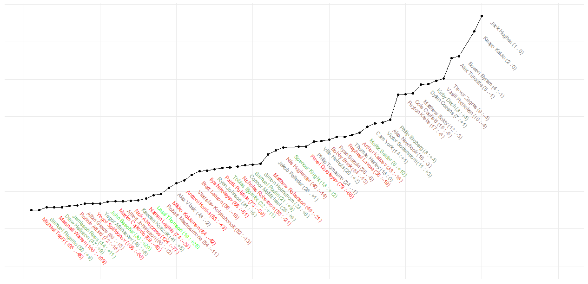

Il y a quelques jours, des membres de la communauté .Layer se sont réunis dans un chalet autour d'une thématique: l'analyse de données sportives. Lors de ce week-end, nous avons effleuré trois projets reliant sports et analyse de données:

1. Agréger différents *draft rankings* (LNH) pour en former un unique (L-A Vallière-Lavoie, Laurent Caron et Sam Perreault)
2. Un [dashboard](https://stecaron.shinyapps.io/shiny-app/) de données permettant d'identifier les meilleurs jeunes joueurs de tennis de l'ATP (Phil B-l, Sté Caron, Sam Auclair, John Tremblay et J.P. Le Cavalier)
3. Un outil pour trouver le bon régime et le bon programme d'entraînement selon des objectifs (Antoine Buteau)

Cet article sommarise très brièvement le projet d’agrégation de listes de repêchages. Le timing était bon puisqu'une semaine après le chalet, c'était ledit repêchage de la LNH.

## Extraire les données

Pour extraire nos données, nous avons *scrapé* des listes produites par des experts ([mynhldraft.com](http://www.mynhldraft.com/2019-nhl-draft/2019-nhl-draft-rankings/)) en utilisant le *package* R `rvest`:

```
library(rvest)
library(data.table)

html <- read_html("http://www.mynhldraft.com/2019-nhl-draft/2019-nhl-draft-rankings/")

tables <- html %>%
  html_nodes("table")

tables <- lapply(tables, html_table, fill=T)
tables <- tables[-1]

temp <- as.data.table(do.call(cbind, tables))[-1,]

names(temp) <- unlist(temp[1,])
names(temp) <- gsub("\n", "", names(temp))
temp <- temp[-1,]

head(temp)[,1:3]
```


```
##    V1 Future Considerations    June 7th
## 1:  1                       Jack Hughes
## 2:  2                       Kakko Kaapo
## 3:  3                       Bowen Byram
## 4:  4                  Vasili Podkolzin
## 5:  5                     Alex Turcotte
## 6:  6                      Peyton Krebs
##    Russ Cohen    Sportsology    June 7th
## 1:                           Jack Hughes
## 2:                           Kaapo Kakko
## 3:                         Alex Turcotte
## 4:                      Vasily Podkolzin
## 5:                           Bowen Byram
## 6:                         Cole Caufield
```

Les 14 listes (nous en avons retiré 2 parce qu'elles concernaient seulement les Européens et les Nord-Américains respectivement) contiennent un classement des 32 meilleurs espoirs (choix de première ronde) pour le repêchage de la LNH selon différents experts.

## Métriques

Après un peu plus de nettoyage (on vous épargne les détails), nous avons créé un jeu de données `main`.
Avec un passage de `data.table` à `dplyr`, nous avons comparé quelques métriques.
En particulier, nous avons effectué une correction (très basique) pour palier au fait que certains joueurs ne se retrouvaient pas dans toutes les listes: 60 joueurs au total apparaissaient dans au moins une liste, mais seulement 32 joueurs sont sélectionnés en première ronde.
Voici notre top 10 du repêchage selon cette métrique.

```
library(tibble)
library(purrr)
library(magrittr)
library(dplyr)

main <- fread("data/main.R", encoding = "UTF-8")

by_player <- data.table(player = player <- unique(unlist(main[, player])),
                         ID = as.numeric(as.factor(player)))

main %<>%
  left_join(by_player, by = "player")

by_player <-
  by_player %>%
  left_join(main %>%
              group_by(ID) %>%
              summarise(straight_average = mean(rank),
                        min_ranking = min(rank),
                        max_ranking = max(rank),
                        variance = var(rank),
                        count = n(),
                        median = median(rank),
                        corrected_average = (sum(rank) + (14 - count) * 33) / 14) %>%
              mutate(final_selection = rank(corrected_average)),
            by = "ID")

by_player[order(by_player$final_selection),]$player[1:10]
```


```
##  [1] "Jack Hughes"      "Kaapo Kakko"      "Bowen Byram"     
##  [4] "Alex Turcotte"    "Trevor Zegras"    "Kirby Dach"      
##  [7] "Dylan Cozens"     "Vasili Podkolzin" "Matthew Boldy"   
## [10] "Peyton Krebs"
```

## Multi-dimensional scaling

Avec le temps qu'il nous restait, nous avons décidé de construire une matrice de distances (entre les joueurs) calculée en considérant le vecteur des rangs:


```
##      Albert Johansson Albin Grewe Alex Newhook Alex Turcotte Alex Vlasic
## [1,]               33          28           15             3          33
## [2,]               33          33           14             4          25
## [3,]               33          33           11             3          24
## [4,]               33          33           18            10          33
## [5,]               33          33           13             5          33
```

Chaque rangée correspond aux prédictions d'un expert. Nous avons remplacé les NA (ceux qui ne sont pas parmi les 32 premiers choix) par des 33. Clairement, ce n'est pas la meilleure chose à faire, les étapes suivantes auraient pu nous aider à faire une imputation plus sensée, mais nous n'avons pas pris le temps...

Nous avons calculé une sorte de variation locale des rangs:


Naturellement, plus on considère des rangs élevés, plus il y a d'incertitude quant à ceux-ci (du moins cette année). Ce qui se passe après 25 ne fait plus de sens puisque nos données sont censurées à droite.
Nous avons utilisé ceci (en gardant la valeur maximum après le *peak*), pour calculer des distances *somewhat* normalisées (entre les joueurs).

Finalement, la matrice de distances obtenue nous a permis de projeter nos données sur une droite (une seule dimension) : ce qu'on appelle du positionnement multidimensionnel. En fait, nous avons *pluggé* la matrice de distances dans la fonction `cmdscale`. Les valeurs obtenues forment l'axe vertical dans la figure suivante:


En gardant un espacement constant sur l'axe horizontal, on peut apprécier à quel point Jack Hughes et Kaapo Kakko se démarque du reste (ils étaient toujours premier et deuxième ...).

Comme mentionné en introduction, le repêchage officiel de la LNH avait lieu quelques jours après notre première analyse (figure ci-haut).
Les résultats sont présentés dans la figure ci-dessous: les noms des joueurs sont accompagnés de leur rang observé, ainsi que la différence entre la prédiction de l'agrégation d'experts et le rang observé. 
Les noms de joueurs en gris ont été repêchés au rang prévu, les rouges ont été repêchés plus tard que prévu alors que les verts ont été repêché plus tôt que prévu.



On remarque qu'il n'y a pas eu de surprise concernant Jack Hugues et Kaapo Kakko.
D'autres sélections ont surpris les experts, par exemple Kirby Dach qui à monté de 4 rangs (ce qui est intéressant considérant la faible incertitude du top 10).
Il y aussi Moritz Seider qui a grimpé de 10 rangs en étant repêché 6ème au total par Détroit.
Parmi les joueurs repêchés plus tard que prévu, on remarque le Russe Arthur Kaliyev et le Québécois Raphaël Lavoie qui ont respectivement dégringolés des rangs 16 et 19 pour finalement aboutir en 2ème ronde.
C'est d'ailleurs deux joueurs très talentueux dont certains experts remettaient en question leur éthique de travail.

Le reste de l'analyse est laissé en exercice hehe ;)

À+
