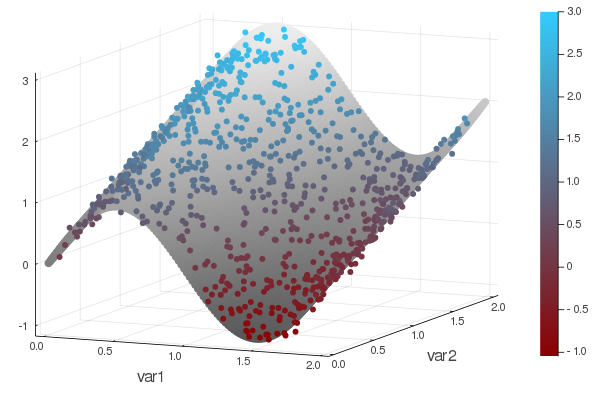
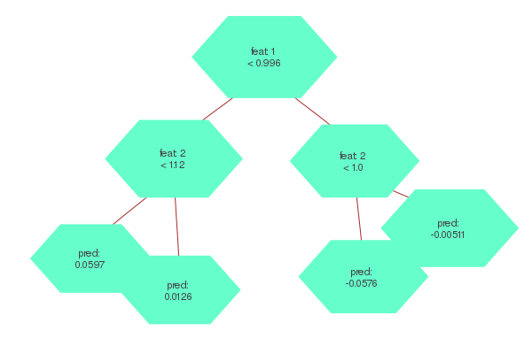
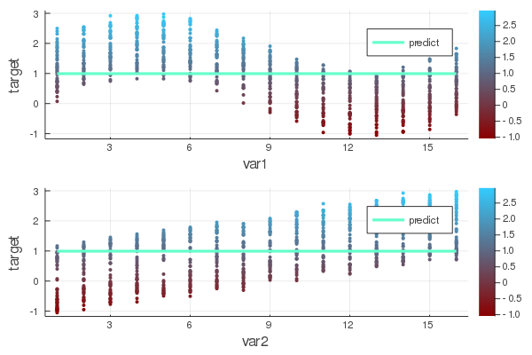
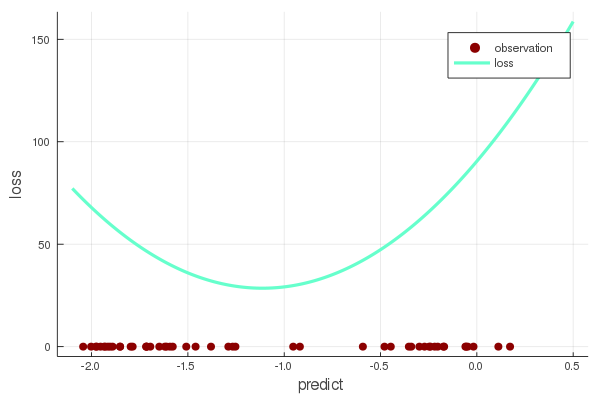

> Cet article a pour but d'exposer les principes clés permettant une implantation haute performance du gradient boosting trees en Julia, un langage réconciliant l'expressivité et la productivité qu'on retrouve en Python et en R et la performance de langages compilés comme le C et C++. 

Bien que les approches par réseaux de neurones accaparent une bonne partie de l'attention, l'importance des algorithmes reposant sur des arbres de décision ne peut être négligée. Ils continuent de se démarquer comme offrant la meilleure performance prédictive dans de nombreuses situations, particulièrement lorsqu'il s'agit de problèmes de régression ou de classification impliquant des données tabulaires.

Parmi les plus célèbres représentants de cette famille d'algorithmes, on compte [XGBoost](https://xgboost.readthedocs.io/en/latest/), [LightGBM](https://lightgbm.readthedocs.io/en/latest/) et [CatBoost](https://catboost.ai/). Si ces dernières implantations sont relativement récentes (2014, 2016 et 2017), l'idée avait été développée depuis déjà quelques années puisqu'on la retrouve dès 2001 dans le désormais classique [Elements of Statistical Learning](https://web.stanford.edu/~hastie/ElemStatLearn/). 

Il serait hasardeux d'apporter un diagnostic définitif sur ce qui a conduit à l'explosion de popularité de l'algorithme. L'intérêt pour l'apprentissage machine et le développement d'une approche compétitive à la modélisation via des plateformes comme Kaggle n'y sont sans doute pas étrangers. Un atout du gradient boosting est également sa rapidité: XGBoost apportait à sa sortie une réduction du temps d'entraînement de l'ordre de 10X par rapport aux implantations en R et Python existantes. 

Dans un contexte d'utilisation commerciale, les enjeux de performance deviennent rapidement significatifs compte tenu des volumes de données impliqués. Le souci qu'on y accorde au sein de la nouvelle génération d'algorithmes n'est sans doute pas étranger à ces impératifs commerciaux. Aussi, lorsqu'il est question de performance, le coeur d'un algorithme est typiquement développé dans un langage compilé (C/C++), bien que l'utilisateur interagit le plus souvent avec celui-ci au travers d'interfaces en Python ou R qui facilitent le développement expérimental.  

Une facette intéressante du langage Julia est qu'il permet de briser cette barrière des 2 langages. La figure ci-dessous montre que contrairement à XGBoost, l'intégralité de l'implantation [Julia du gradient boosting](https://github.com/Evovest/EvoTrees.jl) est codée... en Julia! 


On verra maintenant plus en détail comment il est possible d'implanter des algorithmes "from scratch" dans un langage convivial tout en obtenant des vitesses d'exécution compétitives avec les solutions les plus performantes sur le marché. 

## Mise en contexte

Afin de rendre plus tangible les détails de l'implantation du gradient boosting en Julia, un problème de régression avec 2 variables continues servira d'exemple. 

La variable réponse est dépendante des variables `var1` et `var2`. L'effet est sinusoïdal en `var1` et croissant en `var2`.




## Introduction à l'algorithme

L'entraînement d'un gradient boosting trees peut être décrit sommairement de la manière suivante: 

0. Définir une prédiction de base pour chacune des observations. Ex: pred = 0.0
1. Construire un arbre de décision, _A1_ expliquant la différence entre les prédictions et les valeurs observées.  
2. Mettre à jour les prédicions en ajoutant les prédictions de l'arbre _A1_ aux prédictions actuelles: pred = pred + predict(_A1_)
3. Répéter 1. et 2. pour un nombre N d'arbres.

Dans un scénario où le nombre d'itérations serait de 4, le modèle entraîné pourrait se visualiser de la façon suivante: 


Pour obtenir une prédiction, il suffit d'additionner la prédiction obtenue à chacun des 4 arbres. 

Comme on peut le constater, un modèle GBT ne consiste qu'en une collection d'arbres de décision. Quelques subtilités sont néanmoins introduites en pratique, par exemple le rééchantillonnage des observations et des variables explicatives à chacune des itérations. Reste qu'une fois qu'on a établi comment construire un arbre de décision, l'essentiel du travail est accompli. À noter que la même logique s'appliquerait si on construisait un RandomForest: il ne suffirait encore là que de savoir construire un arbre de décision, le reste n'étant qu'une variation de l'algorithme présenté plus haut. 

En Julia, on peut définir la structure du modèle de la manière suivante, où un GBTree est composé d'un vecteur de Tree: 

```julia
struct GBTree
    trees::Vector{Tree}
    params
    metric
end
```

En son coeur Julia supporte des représentations multi-dimensionnelles via des `Array{T,N}`. Un vecteur `Vector{T}` ou une matrice `Matrix{T}` ne sont que des cas particuliers des `Array{T,N}`, où `N` = 1 et 2 respectivement. L'élément `T` réfère au type. Par exemple, un vecteur peut être défini par: `[1.1, 2.2]`. la nature de cet objet serait `Vector{Float64}`. En Julia, la représentation multi-dimensionnelle ne se limite pas aux nombres conventionnels comme les Float ou les Integer, ça peut être n'importe quel type d’objet. Par exemple, on pourrait parfaitement avoir une matrice dont les éléments sont des DataFrames (mais le produit matriciel de ces objets resterait à définir!). Dans le cas de GBT, le modèle est ainsi constitué d'un `Vector{Tree}`. 

## Définition d'un arbre

Tel que montré plus haut, un arbre de décision se compose d'une série de noeuds comportant chacun une décision binaire. Par exemple, dans l'arbre ci-dessous, on commence par établir, pour chaque observation, si la variable 1 est plus petite que 0.996. Si oui, on va dans le segment de gauche et la décision suivante est si la variable 2 est plus petite que 1.12. On arrive ensuite à un noeud terminal qui indique la prédiction à associer à l'observation. 



Une structure récursive peut être une représentation intuitive pour un arbre qui serait alors définit comme un noeud contenant le critère de décision ainsi que 2 noeuds dépendants ("child nodes") selon que la condition soit respectée ou non. Il est également possible de représenter un arbre par un simple vecteur de noeuds: 

```julia
struct Tree{L, T<:AbstractFloat, S<:Int}
    nodes::Vector{TreeNode}
end
```

```julia
struct TreeNode{L, T<:AbstractFloat, S<:Int, B<:Bool}
    left::S
    right::S
    feat::S
    cond::T
    pred::SVector{L,T}
    split::B
end
```

Comme on peut le voir dans la structure `TreeNode`, pour chaque noeud on doit définir sur quelle variable la décision doit être prise ainsi que la condition à appliquer. 

Une fois les structures établies, il ne reste plus qu'à identifier les valeurs elles doivent prendre. 

## Construction d'un arbre

Il s'agit d'évaluer pour chaque variable la condition apportant la plus grande réduction de la fonction de perte. C'est là que l'essentiel de la charge de calcul se trouve et que certains choix de design permettront d'atteindre des performances optimales. Ensuite, la variable dont la condition optimale apporte le plus grand gain sera retenue pour définir la condition du noeud. 

Pour chaque noeud, l'algorithme s'exerce d'une perspective univariée. Il s'agit là d'un propriété se prêtant à une optimisation. Puisque l'évaluation de la meilleure condition se fait de façon indépendante pour chaque variable, cette recherche peut aisément être parallélisée.

Julia supporte plusieurs saveurs de parallélisme. Dans le cas de la recherche de variables, tous les coeurs du processeur peuvent être mis à profit simplement en utilisant la macro `@threads` incluse dans les fonctionnalités de base du langage.  

```julia
@threads for j in cols
  find_best_split!(...)
end
```

Une façon brute de chercher le meilleur bris est de mettre en ordre les observations selon une variable donnée. Une fois les observations en ordre, on peut considérer pour chacune des valeurs uniques prises par cette variable quel serait le gain si la condition s'exerçait sur cette valeur. 

Une telle approche fonctionne, mais est sujette à quelques inconvénients. D'abord, ordonner une variable est une opération coûteuse, particulièrement si on considère que l'opération doit être répétée pour plusieurs variables, pour chacun des noeuds et pour chaque arbre. Également, si le nombre de valeurs uniques prises par une variable est très élevée, ça implique d'évaluer le gain à un très grand nombre de reprises. 

La méthode de l'histogramme permet de contourner ces obstacles. L'idée est de discrétiser chaque variable en associant chaque observation à un groupe, par exemple le quantile. En utilisant un entier entre 0 et 255 comme identifiant de ces groupes, la matrice de données est encodée dans un format UInt8, lequel accapare 8 fois moins de mémoire qu'un format Float64 (un _numeric_ en R). 

Avant la construction des arbres, la librairie EvoTrees effectue cette discrétisation en trouvant d'abord les quantiles pour chacune des variables (get_edges), puis en créant une matrice de `UInt8` pour encoder les données d'entraînement.

```julia
edges = EvoTrees.get_edges(X_train, params.nbins)
X_bin = EvoTrees.binarize(X_train, edges)
```

En choisissant le nombre de groupe (nbins) comme étant 16, le problème à résoudre prend la forme suivante d'un point de vue univarié: 



Sous cette formulation, le nombre de conditions à évaluer se limite désormais à 15 (ou plus généralement, nbins-1). 

Il reste enfin à définir le gain associé à chacun des bris. Une force du gradient boosting est sa flexibilité. Sous l'implantation introduite par XGboost, il suffit de définir une fonction de perte qui soit convexe. Par exemple, avec une régression des moindres carrés, la perte est définie par $(y - pred)^2$. Cette perte a une forme parabolique et son minimum est bien entendu lorsque la valeur prédite égale la valeur observée. La notion critique à remarquer est qu'en ne connaissant que les dérivées premières et secondes de la perte par rapport à la prédiction, il est possible de déterminer non seulement quelle serait la prédiction optimale, mais également la réduction de la perte. 

Pour la première des 15 conditions possibles, l'arbre distinguerait les données en deux groupes (gauche et droite) de la manière suivante: 


Le gain se définit comme la réduction de la perte qu'apporterait une modification à la prédiction. Il est calculé séparément pour les groupes de gauche et de droite. La perte associée à différentes modifications de la prédiction pour le groupe de gauche est la suivante:



On calcule également la perte sur l'ensemble des données. Effectuer un bris dans l'arbre devra apporter un gain par rapport à cette valeur de référence. 

Il est à noter que la perte minimale est atteinte lorsque la prédiction est de -1.11, ce qui correspond à la moyenne des résidus pour le groupe 1. 

Puisqu'une approximation de second degré (i.e. les dérivées premières et secondes) est utilisée pour représenter la perte, il existe une solution analytique permettant d'obtenir la valeur de la prédiction optimale et de la réduction de la perte associée à cette dernière. Ça revient à trouver le minimum d'une fonction parabolique, soit la valeur de la prédiction où la dérivée première de la perte est égale à 0. La dérivée de la fonction de perte étant linéaire, l'approche par descente du gradient donne une solution exacte. 

$gain = \fraction{\sigma^2}{(\sum \sigma^2 + \lambda \times \sum \omega) \times 2}$

$pred = - \fraction{\eta \times \sum \sigma}{\sum \sigma^2 + \lambda \times \sum \omega}$

Au terme du processus d'entraînement, le modèle prend la forme suivante:


## Évaluation de la performance

Comparaison du temps d'entraînement pour 100 itérations sur des données générées aléatoirement. 

| Dimensions / Algo | XGBoost Exact | XGBoost Hist | EvoTrees |   |
|-------------------|:-------------:|:------------:|:--------:|---|
| 10K x 100         |     1.18s     |     2.15s    |   0.52s  |   |
| 100K x 100        |     9.39s     |     4.25s    |   2.02s  |   |
| 1M X 100          |     146.5s    |     20.2s    |   22.5   |   |

Il en ressort que la méthode par histogramme est critique pour obtenir de bonnes performances au-delà de quelques centaines de milliers d'observations. Aussi, au-delà du million d'observations, XGBoost reprend l'avantage sur EvoTrees. 

EvoTrees supporte par ailleurs quelques fonctions de pertes qu'on ne retrouve pas dans XGBoost, dont la régression par quantile ainsi que la régression Gaussienne (estimation simultanée des paramètres $\mu$ et $\sigma$ de la distribution). 

## Développements futurs

Une piste de développement serait de d'envisager différentes mode de parallélisme avec des données plus volumineuse afin de combler l'écart de performance avec des données > 1 M d'observations, par exemple en parallélisant la construction d'histogrammes à l'intérieur d'une même variable. Également, fidèle à l'esprit de résolution du problème des deux langages, Julia offre des fonctionnalités prometteuses pour le développement d'algorithmes sur [GPU](https://juliacomputing.com/domains/gpus.html). Supporter la construction d'histogrammes en CUDA pourrait ainsi être la meilleure réponse pour le traitement de données très volumineuses.  
