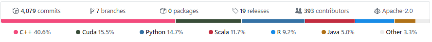
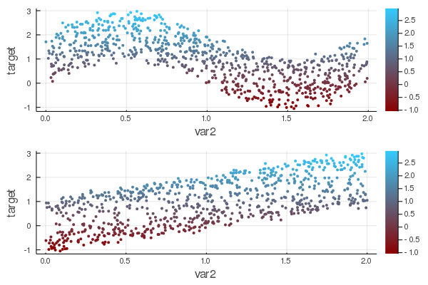
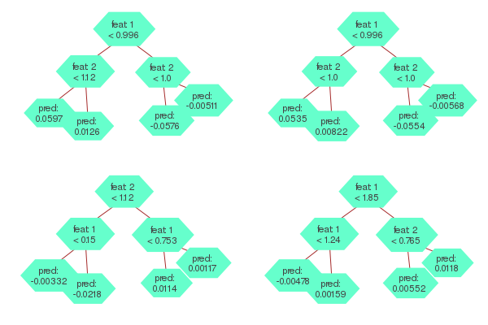
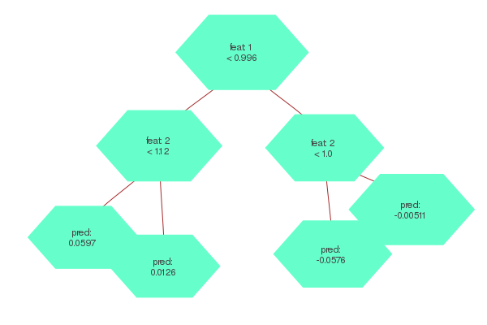
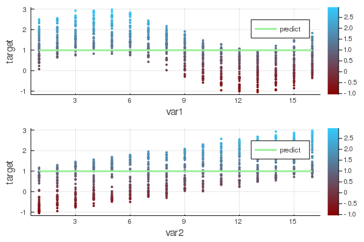
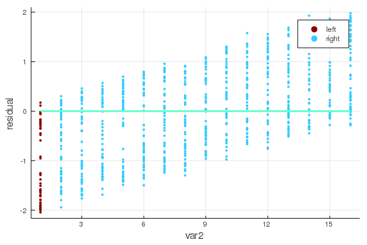
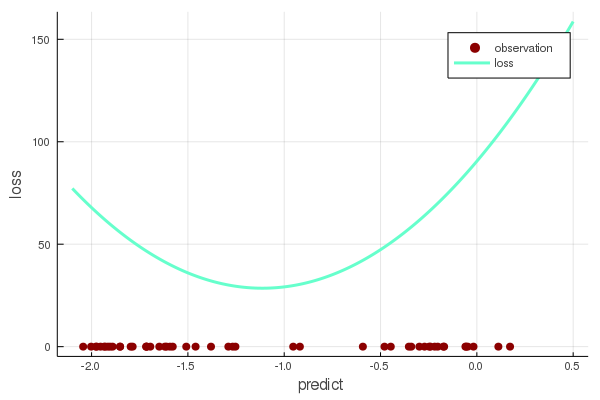

```{r setup, include=FALSE}
library(magrittr)
library(data.table)
library(plotly)
library(ggplot2)
library(knitr)
library(kableExtra)
library(extrafont)
library(scales)
# library(EvoTrees)
```


> Cet article a pour but d'exposer les principes clés permettant une implantation haute performance du gradient boosting trees en Julia, permettant de bénéficier à la fois de l'expressivité d'un language dynamique comme Python ou R et de la performance d'un langage compilé le C/C++. 

Bien que les approches par réseaux de neuronnes accaparent une bonne partie de l'attention, l'importances des algorithmes reposant sur des artbres de décision ne peut être négligée. Ils continuent de se démarquer comme offrant la meilleure performance prédictive dans de nombreuses situations, particulièrement lorsqu'il s'agit de problèmes de régresion ou de classification impliquant des données tabulaires.

Parmi les plus célèbres représentants de cette famille d'algorithmes, on compte [Xgboost](https://xgboost.readthedocs.io/en/latest/), [LightGBM](https://lightgbm.readthedocs.io/en/latest/) et [CatBoost](). Si ces dernières implantations sont relativement récentes (2014, 2016 et 2017), l'algorithme avait été développé depuis déjà quelques années, puisqu'on le retrouve dès 2001 dans le désormais classique [Elements of Statistical Learning](https://web.stanford.edu/~hastie/ElemStatLearn/). 

Il serait hasardeux d'apporter un diagnostic définitif sur ce qui a conduit à l'explosion de popularité de l'algorithme. L'intérêt pour pour le l'apprentissage machine et le développement d'une approche compétitive à la modélisation via des plateformes comme Kaggle n'y sont sans doute pas étrangers. Un atout du gradient boosting est également sa rapidité: Xgboost apportait à sa sortie une réduction du temps d'entraînement de l'ordre de 10X par rapports au implantations R et Python existantes. 

Dans un contexte d'utilisation commerciale, les enjeux de performance deviennent rapidement significatifs compte tenu des volumes de données impliqués. Le soucis qu'on y accorde au sein de la nouvelle génération d'algorithmes y est sans doute lié. Aussi, lorsqu'il est question de performance, le coeur de l'algorithme est typiquement développé dans un lnagage compilé tel le le C/C++, bien que l'utilisateur interagit le plus souvent au travers de langages dynamiques comme Python et R et facilient l'interface avec le code source.  

Dans ce contexte, une des facettes intéressante du langage Julia qui se veut une réponse à l'enjeu des 2 langages. Les figure ci-dessous montrent que l'intégralité de l'implantation Julia du gradient boosting est codée... en Julia! 



La suite de l'article a pour but de montrer comment il est possible d'implanter des algorithmes "from scratch" dans un langage convivial tout en obtenant des vitesses d'exécution compétitives aux solutions les plus performantes sur le marhcé. 


## Mise en contexte

Afin de rendre plus tangible les détails de l'implantation du gradient boosting en Julia, un problème de régression avec 2 variables continues est présenté. 

La variable réponse est dépendante des variables var1 et var2. L'effet est sinusoïdal en `var1` et croissant en `var2`.





## Introduction à l'algorithme

L'entraînement d'un gradient boosting trees peut être décrit sommairement de la manière suivante: 

0. Définir une prédiction de base pour chacune des observations. Ex: pred = 0.0
1. Construire un arbre de décision, _A1_ expliquant la différence entre les prédicitons et les valeurs observées.  
2. Mettre à jour les prédicions en ajoutant les prédictions de l'arbre _A1_ aux prédictions actuelles: pred = pred + predict(_A1_)
3. Répéter 1. et 2. pour un nombre N arbres.

Dans un scénario où le nombre d'itértions est 4, le modèle entraîné pourrait se visualiser de la façon suivante: 



Pour obtenir une prédiction, il suffit d'additionner la prédiction obtenue à chacun des 4 arbres. 

Comme on peut le constater, un modèle GBT ne consiste qu'en une collection d'arbres de décision. Quelques subtilités sont néanmoins introduites en pratique, par exemple le réchantillonnage des observations et des variables explicatives à chacune des itérations. Reste qu'une fois qu'on a établit comment construire un arbre de décision, l'essentiel du travail est accompli. À noter que la même logique s'appliquerait si on construisait un RandomForest: il ne suffirait encore là que de savoir construire un arbre de décision, le reste n'est qu'une variation de l'algorithme présenté plus haut. 

En julia, on peut définir la structure du modèle de la manière suivante, où un GBTree est composée d'une vecteur de Tree: 

```julia
struct GBTree
    trees::Vector{Tree}
    params
    metric
end
```

En son coeur Julia supporte des représentations multi-dimensionnelles via des Array{T,N}. Un vector `Vector{T}` ou une matrice `Matrix{T}` ne sont que des cas particulies des Array{T,N}, où N = 1 et 2 respectivement. L'élément `T` dans Array{T,N} réfère au type. Lorsqu'on travaille avec un vecteur de nombres continus, par exemple en R avec `c(1.1, 2.2)` ou en Python avec [1.1, 2.2], on se trouverait dans l'univers Julia à travailler avec un Vector{Float64} (ou encore Float32/Float16 au besoin). En Julia, cette représentation multidimensionnelle ne se limite pas aux nombres conventionnels comme les Float ou les Integer, ça peut être n'importe quel type d'object. Par exmeple, on pourrait parfaitement avoir une matrice dont les éléments sont des DataFrames (mais le produit matriciel de tels objects resterait à définir!). Dans le cas présent, le choix est pris de définir un modèle de GBTree comme constitué d'une vecteur d'arbres. 

## Définition d'un arbre

Tel que montré plus haut, un arbre de décision se compose d'une série de noeuds comportant chacun une décision binaire. Par exemple, dans l'arbre ci-dessous, on commence par décider, pour chaque observation, si la variable 1 est plus petite que X. Si on va dans le segment de gauche, la décision suivante est si la variable 2 est plus petite que `X`. On arrive ensuite à un noeud terminal qui indique la prédiction à associer à l'observation. 



Une structure récursive peut être une représentation intuitve pour un arbre. On définit alors comme objet un noeud qui contient le critère de décision ainsi que 2 noeuds dépendants ("child nodes") selon que la condition soit respectée ou non. Il est également possible de représenter un arbre par un simple vecteur de noeuds: 

```julia
struct Tree{L, T<:AbstractFloat, S<:Int}
    nodes::Vector{TreeNode}
end
```

```julia
struct TreeNode{L, T<:AbstractFloat, S<:Int, B<:Bool}
    left::S
    right::S
    feat::S
    cond::T
    pred::SVector{L,T}
    split::B
end
```

Comme on peut le voir dans le TreeNode, pour chaque noeud on doit définir sur quelle variable la décision doit être prise ainsi que la condition à appliquer. 

Une fois les structures en place, ne reste plus qu'à identifier les valeurs que doivent prendre ces structures.

## Construction d'un arbre

Il s'agit d'évaluer pour chaque variable la condition apportant le plus grande réduction de la fonction de perte. C'est là que l'essentiel de la charge de calcul se trouve et que certains choix de design permettront d'atteindre des performances optimales. Ensuite, la variable dont la condition optimale apporte le plus grand gain sera retenu pour définir la condition pour le noeud. 

Pour chaque noeud, l'algorithme s'exerce d'une perspective univariée. La capacité d'un arbre à réfléter des intéractions entre variables provient du fait que les conditions dans les sous-branches s'exercent de façon indépendante. On a là un premier élément se prêtant à une optimisation: puisque l'évaluation de la meilleure condition se fait de façon indépendante pour chaque variable, il s'agit d'une recherche qui se parallélise aisément. 

Julia supporte plusieurs saveurs de parallélisme. Dans le cas de la recherche de variables, tous les coeurs du processeur peuvent être mis à profit simplement en utilisant la macro `@threads`. 

```julia
@threads for j in cols
  find_best_split!()
end
```

Une façon brute de chercher le meilleur bris est de de mettre en ordre les observations selon une variable donnée. Une fois les observations en ordre, on peut considérer pour chacune des valeurs uniques prises par cette variable quel serait le gain si la condition s'exerçait sur cette valeur. 

Une telle approche fonctionne, mais est sujette à quelques inconvnients. D'abord, ordonner une variable est une opération couteuse, particulièrement si on considère que l'opération doit être répétée pour plusieurs variables, pour chacun des noeuds et pour chaque arbre. Également, si le nombre de valeurs uniques prises par une variable est très élevée, ça implique d'évaluer le gain à un très grand nombre de reprises. 

La méthode de l'histogramme permet de contourner ces obstacles. L'idée de discrétiser chaque variable en associant chaque observation à un groupe, basé par exemple sur le quantile. En utilisant un entier entre 0 et 255 comme identifiant de ces groupes, la matrice de données est encodée dans un format UInt8, lequel accapare 8 fois moins de mémoire qu'un format Float64 (un _numeric_ en R). 

Avant la construction des arbres, la librairie EvoTrees effectue cette discrétisation en trouvant d'abord les quantiles pour chacune des variables (get_edges), puis en créant une matrice de `UInt8`.

```julia
edges = EvoTrees.get_edges(X_train, params.nbins)
X_bin = EvoTrees.binarize(X_train, edges)
```

En choisissant le nombre de groupe (nbins) comme étant 16, le problème à résoudre prend la forme suivante d'un point de vue univarié.



Sous cette formulation, le nombre de conditions à évaluer se limite désormais à 15 (ou plus généralement, nbins-1). 

Il reste enfin à définir le gain associé à chacun des bris. Une force du gradient boosting est sa flexibilité. Sous l'implantation introduite par Xgboost, il suffit de définir une fonction de perte qui soit convexe et donc que la dérivée seconde existe et soit positive en tout point. Pour l'illustrer, on peut prendre le cas d'une régression classique. 

Avec une régression des moindre carrés, la perte est définie par $(y - pred)^2$. Cette perte a une forme parabolique et son minimum est bien entendu lorsque la valeur prédite égale la valeur observée. La notion critique à remarquer est qu'en ne connaissant que les dérivées premières et secondes de la perte par rapport à la prédiction, il est possible de déterminer non seulement quel serait la prédiction optimale, mais également la réduction de la perte. 

Pouor le premier des 15 conditions possibles, l'arbre distinguerait les données en les groupes gauche et droite de la manière suivante:  



Le gain apporté est calculé comme la réduction de la perte qu'apporterait cette décision. Pour y arriver, on calcule d'abord la perte sur l'ensemble des données. Effectuer un bris dans l'arbre devra apporter un gain par rapport à cette valeur de référence. 

Ensuite, le gain est calculé séparément pour les groupes de gauche et de droite. La perte associée à différentes prédictions pour le groupe de gauche est la suivante:



Il est à noter que la perte minimale est atteinte lorsque la prédictions est de -1.11, ce qui correspond à la moyenne des résidus pour le groupe 1. 

Puisqu'une approximation de 2e degré (dérivées première et seconde) est utilisée pour représenter la perte, il existe une solution analytique permettant d'obtenir la valeur de la prédiction optimale et de la réduction de la perte associée à cette dernière. Ça revient à trouver le minimum d'une fonction parabolique, soit la valeur de la prédiction où la dérivée première de la perte est égale à 0. La dérivée de la fonction de perte étant linéaire, l'approche par descente du gradient donne une solution exacte. 

$gain = (δ) ^ 2 / (∑δ² + λ * ∑𝑤)/2$

$pred = - η * ∑δ / (∑δ² + λ * ∑𝑤)$


