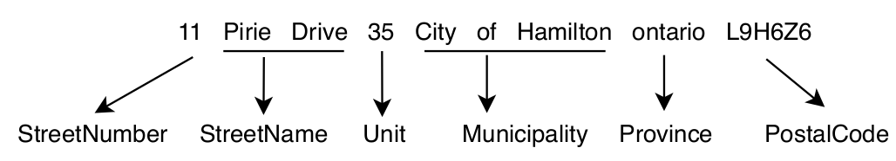

> In this article, we will train an RNN, or more precisely, an LSTM, to predict the sequence of tags associated with a 
given address, known as address parsing.

> Also, the article is available in a [Jupyter Notebook](https://github.com/dot-layer/blog/blob/master/Github/blog/content/blog/2020-08-19-train-a-sequence-model-with-poutyne/article_notebook.ipynb) or in a [Google Colab Jupyter notebook](https://colab.research.google.com/github/dot-layer/blog/blob/post%2Fdb_sequence_training_poutyne/content/blog/2020-08-19-train-a-sequence-model-with-poutyne/article_notebook_colab.ipynb).
>
> Before starting this article, we would like to disclaim that this tutorial is greatly inspired by an online tutorial David created for the Poutyne framework. Also, the content is based on a recent [article](https://arxiv.org/abs/2006.16152) we wrote about address tagging. However, there are differences between the present work and the two others, as this one is specifically designed for the less technical reader.


Sequential data, such as addresses, are pieces of information that are deliberately given in a specific order. In other words, they are sequences with a particular structure; and knowing this structure is crucial for predicting the missing entries of a given truncated sequence. For example, 
when writing an address, we know, in Canada, that after the civic number (e.g. 420), we have the street name (e.g. du Lac).
Hence, if one is asked to complete an address containing only a number, he can reasonably assume that the next information that should be added to the sequence is a street name. Various modelling approaches have been proposed to make predictions over sequential data. Still, more recently, deep learning models known as Recurrent Neural Network (RNN) have been introduced for this type of data.

The main purpose of this article is to introduce the various tricks (e.g., padding and packing) that are required for training an RNN. Before we do that, let us define our "address" problem more formally and elaborate on what RNNs (and LSTMs) actually are.

## Address Tagging
Address tagging is the task of detecting and tagging the different parts of an address such as the civic number, 
the street name or the postal code (or zip code). The following figure shows an example of such a tagging.



For our purpose, we define 8 pertinent tags that can be found in an address: `[StreetNumber, StreetName, Orientation, Unit, Municipality, Province, PostalCode, GeneralDelivery]`.

Since addresses are sequences of arbitrary length where a word's index does not mean as much as its position relative to others, one can hardly rely on a simple fully connected neural network for address tagging.
A dedicated type of neural networks was specifically designed for this kind of tasks involving sequential data: RNNs.

## Recurrent Neural Network (RNN)

In brief, an RNN is a neural network in which connections between nodes form a temporal sequence. It means that this type of network
allows previous outputs to be used as inputs for the next prediction.
For more information regarding RNNs, have a look at Stanford's freely available [cheastsheet](https://stanford.edu/~shervine/teaching/cs-230/cheatsheet-recurrent-neural-networks). 

For our purpose, we do not use the vanilla RNN, but a widely-use variant of it known as long short-term memory (LSTM) network. This latter, which involves components called gates, is often preferred over its competitors due to its better stability with respect to gradient update (vanishing and exploding gradient).
To learn more about LSTMs, see [here](http://colah.github.io/posts/2015-08-Understanding-LSTMs/) for an in-depth explanation. 

For now, let's simply use a single layer unidirectional LSTM. We will, later on, explore the use of more layers and a bidirectional approach. 

### Word Embeddings

Since our data is text, we will use a well-known text encoding technique: word embeddings. Word embeddings are vector
representations of words. The main hypothesis underlying their use is that there exists a linear relation between words. For example, the linear relation
between the word `king` and `queen` is gender. So logically, if we remove the vector corresponding to `male` to the one for `king`, and then add the vector for
`female`, we should obtain the vector corresponding to `queen` (i.e. `king - male + female = queen`). That being said, this kind of representation is usually made in high dimensions such as `300`, which
makes it impossible for humans to reason about them. Neural networks, on the other hand, can efficiently make use of the implicit relations despite their high dimensionality.

We therefore fix our LSTM's input and hidden state dimensions to the same sizes as the vectors of embedded words. 
For the present purpose, we will use the
[French pre-trained](https://fasttext.cc/docs/en/crawl-vectors.html) fastText embeddings of dimension `300`. 

### The PyTorch Model

Let us first import all the necessary packages.

```python
%pip install --upgrade poutyne #install poutyne on colab
%pip install --upgrade colorama #install colorama on colab
%pip install --upgrade fasttext #install fasttext on colab
%matplotlib inline

import os
import pickle
import re
from io import TextIOBase

import fasttext
import fasttext.util
import requests
import torch
import torch.nn as nn
import torch.optim as optim
from poutyne import set_seeds
from poutyne.framework import Experiment
from torch.nn.functional import cross_entropy
from torch.nn.utils.rnn import pad_packed_sequence, pack_padded_sequence, pad_sequence
from torch.utils.data import DataLoader
```

Now, let's create a single (i.e. one layer) unidirectional LSTM with `input_size` and `hidden_size` of `300`. We 
will explore later on the effect of stacking more layers and using a bidirectional approach.

> See [here](https://discuss.pytorch.org/t/could-someone-explain-batch-first-true-in-lstm/15402) why we use the `batch_first` argument.

```python
dimension = 300
num_layer = 1
bidirectional = False

lstm_network = nn.LSTM(input_size=dimension,
                       hidden_size=dimension,
                       num_layers=num_layer,
                       bidirectional=bidirectional,
                       batch_first=True)
```


## Fully-connected Layer
Since the output of the LSTM network is of dimension `300`, we will use a fully-connected layer to map it into
a space of equal dimension to that of the tag space (i.e. number of tags to predict), that is 8. 
Finally, since we want to predict the most probable tokens, we will apply the softmax function on this layer
(see [here](https://en.wikipedia.org/wiki/Softmax_function) if softmax does not ring a bell).


```python
input_dim = dimension #the output of the LSTM
tag_dimension = 8

fully_connected_network = nn.Linear(input_dim, tag_dimension)
```

## Training Constants

Now, let's set our training constants. We first specify a CUDA (GPU) device for training (using a CPU takes way too long, 
if you don't have one, you can use the Google Colab notebook). 

Second, we set the batch size (i.e. the number of elements to see before updating the model), the learning rate for the optimizer
and the number of epochs.

```python
device = torch.device("cuda:0")

batch_size = 128
lr = 0.1

epoch_number = 10
```

We also need to set Pythons's, NumPy's and PyTorch's random seeds using the Poutyne function to make our training (almost) completely reproducible.

> See [here](https://determined.ai/blog/reproducibility-in-ml/) for an explanation on why setting seed does not guarantee complete reproducibility.

```python
set_seeds(42)
```

## The Dataset
The dataset consists of `1,010,987` complete French and English Canadian addresses and their associated tags.
Here's an example address

`"420 rue des Lilas Ouest, Québec, G1V 2V3"`

and its corresponding tags

`[StreetNumber, StreetName, StreetName, StreetName, Orientation, Municipality, PostalCode, PostalCode]`.

Now let's download our dataset. For simplicity, a `100,000` addresses test set is kept aside, with 80% of the remaining addresses used for training and 20 % used as a validation set. 
Also note that the dataset was pickled for simplicity (using a Python `list`). Here is the code to download it.

```python
def download_data(saving_dir, data_type):
    """
    Function to download the dataset using data_type to specify if we want the train, valid or test.
    """

    # hardcoded url to download the pickled dataset
    root_url = "https://dot-layer.github.io/blog-external-assets/train_rnn/{}.p"

    url = root_url.format(data_type)
    r = requests.get(url)
    os.makedirs(saving_dir, exist_ok=True)

    open(os.path.join(saving_dir, f"{data_type}.p"), 'wb').write(r.content)


download_data('./data/', "train")
download_data('./data/', "valid")
download_data('./data/', "test")
```

Now let's load the data in memory.

```python
# load the data
train_data = pickle.load(open("./data/train.p", "rb"))  # 728,789 examples
valid_data = pickle.load(open("./data/valid.p", "rb"))  # 182,198 examples
test_data = pickle.load(open("./data/test.p", "rb"))  # 100,000 examples
```

As explained before, the (train) dataset is a list of `728,789` tuples where the first element is the full address, and the second is a list of tags (the ground truth).

```python
train_data[:2] # The first two train items
```

> (the output)


### Vectorize the Dataset

Since we used word embeddings as the encoded representations of the words in the addresses, we need to *convert* the addresses into the corresponding word vectors. In order to do that, we will use a `vectorizer` (i.e. the process of converting words into vectors). This embedding vectorizer will extract, for each word, the embedding value based on the pre-trained French fastText model.
> If you are curious about another solution, the [Google Colab Jupyter notebook](https://colab.research.google.com/github/dot-layer/blog/blob/post%2Fdb_sequence_training_poutyne/content/blog/2020-08-19-train-a-sequence-model-with-poutyne/article_notebook_colab.ipynb) uses Magnitude.
```python
# We use this class so that the download templating of the fastText
# script be not buggy as hell in notebooks.
class LookForProgress(TextIOBase):
    def __init__(self, stdout):
        self.stdout = stdout
        self.regex = re.compile(r'([0-9]+(\.[0-9]+)?%)', re.IGNORECASE)
        
    def write(self, o):
        res = self.regex.findall(o)
        if len(res) != 0:
            print(f"\r{res[-1][0]}", end='', file=self.stdout)

class EmbeddingVectorizer:
    def __init__(self):
        """
        Embedding vectorizer
        """
        fasttext.util.download_model('fr', if_exists='ignore')
        self.embedding_model = fasttext.load_model("./cc.fr.300.bin")

    def __call__(self, address):
        """
        Convert address to embedding vectors
        :param address: The address to convert
        :return: The embeddings vectors
        """
        embeddings = []
        for word in address.split():
            embeddings.append(self.embedding_model[word])
        return embeddings
     
embedding_vectorizer = EmbeddingVectorizer()
```

We also need to apply a similar operation to the address tags (e.g. StreetNumber, StreetName). 
This time, however, the `vectorizer` needs to convert the tags into categorical values (e.g. StreetNumber -> 0). 
For simplicity, we will use a `DatasetBucket` class that will apply the vectorizing process using both 
the embedding and the address vectorization process that we've just described during training. 

```python
class DatasetBucket:
    def __init__(self, data, embedding_vectorizer):
        self.data = data
        self.embedding_vectorizer = embedding_vectorizer
        self.tags_set = {
            "StreetNumber": 0,
            "StreetName": 1,
            "Unit": 2,
            "Municipality": 3,
            "Province": 4,
            "PostalCode": 5,
            "Orientation": 6,
            "GeneralDelivery": 7
        }

    def __len__(self):
        return len(self.data)

    def __getitem__(self, item):  # We vectorize when data is asked
        data = self.data[item]
        return self._item_vectorizing(data)

    def _item_vectorizing(self, item):
        address = item[0]
        address_vector = self.embedding_vectorizer(address)

        tags = item[1]
        idx_tags = self._convert_tags_to_idx(tags)

        return address_vector, idx_tags

    def _convert_tags_to_idx(self, tags):
        idx_tags = []
        for tag in tags:
            idx_tags.append(self.tags_set[tag])
        return idx_tags


train_dataset_vectorizer = DatasetBucket(train_data, embedding_vectorizer)
valid_dataset_vectorizer = DatasetBucket(valid_data, embedding_vectorizer)
test_dataset_vectorizer = DatasetBucket(test_data, embedding_vectorizer)
```  
> Here is a example of the vectorizing process

```python
address, tag = train_dataset_vectorizer[0] # Unpack the first tuple
print(f"The vectorized address is now a list of vectors {address}")
```

```python
print(f"Tag is now a list of integers : {tag}")
```


### DataLoader
> We use a first trick, ``padding``.

Now, because the addresses are not all of the same size, it is impossible to batch them together; recall that all tensor elements must have the same lengths. But there is a trick: padding!

The idea is simple; we add *empty* tokens at the end of each sequence until they reach the length of the longest one in the batch. For example, if we have three sequences of length ${1, 3, 5}$, padding will add 4 and 2 *empty* tokens respectively to the first two.

For the word vectors, we add vectors of 0 as padding. For the tag indices, we pad with -100's. We do so because the [cross-entropy loss](https://pytorch.org/docs/stable/generated/torch.nn.CrossEntropyLoss.html#torch.nn.CrossEntropyLoss) and the accuracy metric both ignore targets with values of -100.

To do the padding, we use the `collate_fn` argument of the [PyTorch `DataLoader`](https://pytorch.org/docs/stable/data.html#torch.utils.data.DataLoader), and on running time, the process will be done by the `DataLoader`. One thing to keep in mind when treating padded sequences is that their original length will be required to unpad them later on in the forward pass. That way, we can pad and pack the sequence to minimize the training time (read [this good explanation](https://stackoverflow.com/questions/51030782/why-do-we-pack-the-sequences-in-pytorch) on why we pack sequences).

```python
def pad_collate_fn(batch):
    """
    The collate_fn that can add padding to the sequences so all can have 
    the same length as the longest one.

    Args:
        batch (List[List, List]): The batch data, where the first element 
        of the tuple is the word idx and the second element are the target 
        label.

    Returns:
        A tuple (x, y). The element x is a tuple containing (1) a tensor of padded 
        word vectors and (2) their respective original sequence lengths. The element 
        y is a tensor of padded tag indices. The word vectors are padded with vectors 
        of 0s and the tag indices are padded with -100s. Padding with -100 is done 
        because of the cross-entropy loss and the accuracy metric ignores 
        the targets with values -100.
    """

    # This gets us two lists of tensors and a list of integer. 
    # Each tensor in the first list is a sequence of word vectors.
    # Each tensor in the second list is a sequence of tag indices.
    # The list of integer consist of the lengths of the sequences in order.
    sequences_vectors, sequences_labels, lengths = zip(*[
        (torch.FloatTensor(seq_vectors), torch.LongTensor(labels), len(seq_vectors)) 
        for (seq_vectors, labels) in sorted(batch, key=lambda x: len(x[0]), reverse=True)
    ])

    lengths = torch.LongTensor(lengths)

    padded_sequences_vectors = pad_sequence(sequences_vectors, batch_first=True, padding_value=0)

    padded_sequences_labels = pad_sequence(sequences_labels, batch_first=True, padding_value=-100)

    return (padded_sequences_vectors, lengths), padded_sequences_labels
```

```python
train_loader = DataLoader(train_dataset_vectorizer, batch_size=batch_size, shuffle=True, collate_fn=pad_collate_fn, num_workers=4)
valid_loader = DataLoader(valid_dataset_vectorizer, batch_size=batch_size, collate_fn=pad_collate_fn, num_workers=4)
test_loader = DataLoader(test_dataset_vectorizer, batch_size=batch_size, collate_fn=pad_collate_fn, num_workers=2)
```

## Full Network
> We use a second trick, ``packing``.

Since our sequences are of variable lengths and that we want to be as efficient as possible when packing them, we cannot use the [PyTorch `nn.Sequential`](https://pytorch.org/docs/stable/generated/torch.nn.Sequential.html) class to define our model. Instead, we define the forward pass so that it uses packed sequences (again, you can read [this good explanation](https://stackoverflow.com/questions/51030782/why-do-we-pack-the-sequences-in-pytorch) on why we pack sequences).

```python
class RecurrentNet(nn.Module):
    def __init__(self, lstm_network, fully_connected_network):
        super().__init__()
        self.hidden_state = None
        
        self.lstm_network = lstm_network
        self.fully_connected_network = fully_connected_network
        
    def forward(self, padded_sequences_vectors, lengths):
        """
            Defines the computation performed at every call.

            Shapes:
                padded_sequences_vectors: batch_size * longest_sequence_length (padding), 300
                lengths: batch_size

        """
        total_length = padded_sequences_vectors.shape[1]
        pack_padded_sequences_vectors = pack_padded_sequence(padded_sequences_vectors, lengths.cpu(), batch_first=True)

        lstm_out, self.hidden_state = self.lstm_network(pack_padded_sequences_vectors)
        lstm_out, _ = pad_packed_sequence(lstm_out, batch_first=True, total_length=total_length)

        tag_space = self.fully_connected_network(lstm_out) # shape: batch_size * longest_sequence_length, 8 (tag space)
        return tag_space.transpose(-1, 1) # we need to transpose since it's a sequence # shape: batch_size * 8, longest_sequence_length

full_network = RecurrentNet(lstm_network, fully_connected_network)
```

## Summary

We have created an LSTM network (`lstm_network`) and a fully connected network (`fully_connected_network`), and we use both
components in the full network. The full network makes use of padded-packed sequences, 
so we created the `pad_collate_fn` function to do the necessary work within the `DataLoader`. Finally, 
we will load the data using the vectorizer (within the `DataLoader` using the `pad_collate` function). This means that the addresses will be represented by word embeddings. 
Also, the address components will be converted into categorical value (from 0 to 7).


## The Training

Now that we have all the components for the network, let's define our optimizer (Stochastic Gradient Descent) 
([SGD](https://en.wikipedia.org/wiki/Stochastic_gradient_descent)).

```python
optimizer = optim.SGD(full_network.parameters(), lr)
```

### Poutyne Experiment
> Disclaimer: David is a developer on the Poutyne library, so we will present code using this framework. See the project [here](https://poutyne.org/).

Let's create our experiment using Poutyne for automated logging in the project root directory (`./`). We will also set
the loss function and a batch metric (accuracy) to monitor the training. The accuracy is compute word-tag, meaning that every correct tag prediction is a good prediction. For example, the accuracy of the prediction `StreetNumber, StreetName` with the ground truth `StreetNumber, StreetName` is 1 and the accuracy of the prediction `StreetNumber, StreetNumber` with the ground truth `StreetNumber, StreetName` is 0.5.

```python
exp = Experiment("./", full_network, device=device, optimizer=optimizer,
                 loss_function=cross_entropy, batch_metrics=["acc"])
```

Using our experiment, we can now launch the training as simply as

```python
exp.train(train_loader, valid_generator=valid_loader, epochs=epoch_number)
```
It will take around 40 minutes per epochs, so around a couple hours for the complete training.

### Results
The next figure shows the loss and the accuracy during our training (blue) and during our validation (orange) steps.
After 10 epochs, we obtain a validation loss and accuracy of `0.01981` and `99.54701` respectively, satisfying values for a first model. Also, since our training accuracy and loss closely match their respective validation values, our model does not appear to be overfitted on the training set.


## Bigger model

It seems that our model performed pretty well, but just for fun, let's unleash the full potential of LSTMs using a
bidirectional approach (bidirectional LSTM). What it means is that instead of _simply_ viewing the sequence from the start to the end, we
also train the model to see the sequence from the end to the start. It's important to state that the two directions are
not shared, meaning that the model _sees_ the sequence in one direction at the time, but gathers the information from both directions into the 
fully connected layer. That way, our model can get insight from both directions.

Instead of using only one layer, let's use a bidirectional bi-LSTM, which means that we use two layers of hidden state for each direction.

So, let's create the new LSTM and fully connected network.

```python
dimension = 300
num_layer = 2
bidirectional = True

lstm_network = nn.LSTM(input_size=dimension,
                       hidden_size=dimension,
                       num_layers=num_layer,
                       bidirectional=bidirectional,
                       batch_first=True)

input_dim = dimension * 2 #since bidirectional

fully_connected_network = nn.Linear(input_dim, tag_dimension)

full_network_bi_lstm = RecurrentNet(lstm_network, fully_connected_network)
```
 
### Training
 
```python
exp_bi_lstm = Experiment("./", full_network_bi_lstm, device=device, optimizer=optimizer,
                         loss_function=cross_entropy, batch_metrics=["acc"])
exp_bi_lstm.train(train_loader, valid_generator=valid_loader, epochs=epoch_number)
```

### Results
Here are our validation results for the last epoch of the larger model. On the validation dataset,
we can see that we obtain a marginal gain of around `0.3` % for the accuracy over our previous simpler model. This is only a slight improvement.

|   Model  | Bidirectional bi-LSTM |
|:--------:|:------------------:|
|   Loss   |    0.0050          |
| Accuracy |    99.8594         |

But now that we have our two trained models, let's use the test set as a final and **unique** step for evaluating their performance.

```python
exp.test(test_loader)
exp_bi_lstm.test(test_loader)
```

The next table presents the results of the bidirectional bi-LSTM with two layers and the previous model (LSTM with one layer).

|   Model  | LSTM one layer | Bidirectional bi-LSTM |
|:--------:|:--------------:|:------------------:|
|   Loss   |     0.0152     |    **0.0050**      |
| Accuracy |     99.5758    |    **99.8550**     |

We see similar validation results for both models. Also, we still see a little improvement in accuracy and total loss for the larger model. Considering that we only improved by around `0.3` %, one can
argue that the difference is only due to training variance (mostly due to our random sampling of training batches). To test the robustness of our approach, we could train our model multiple times
using different random seeds and report the mean and standard deviation of each metric over all experiments rather than the result of a single training. Let's try something else. 

### Zero Shot Evaluation
Since we have at our disposition addresses from other countries, let's see if our model has really learned a typical address sequence
or if it has simply *memorized* all the training examples.

We will test our model on three different types of dataset

   - first, on addresses with the exact same structure 
    as in our training dataset: addresses from the United States of America (US) and the United Kingdom (UK)
   - secondly, on addresses with the exact same structure as those in our training dataset **but** 
    written in a totally different language: addresses from Russia (RU)
   - finally, on addresses that exhibit a different structure **and** that are written in a different language: addresses from Mexico (MX).

For each test, we will use a dataset of `100,000` examples in total, and we will evaluate using the best epoch of our two models (i.e. last epoch for both of them). 
Also, we will use the same pre-processing steps as before (i.e. data vectorization, the same pad collate function), but we will only apply
a test phase, meaning no training step.

First, let's download and vectorize all the needed datasets.

```python
download_data('./data/', "us")
download_data('./data/', "gb")
download_data('./data/', "ru")
download_data('./data/', "mx")

us_data = pickle.load(open("./data/us.p", "rb"))  # 100,000 examples
gb_data = pickle.load(open("./data/gb.p", "rb"))  # 100,000 examples
ru_data = pickle.load(open("./data/ru.p", "rb"))  # 100,000 examples
mx_data = pickle.load(open("./data/mx.p", "rb"))  # 100,000 examples

dataset_vectorizer.vectorize(us_data)
dataset_vectorizer.vectorize(gb_data)
dataset_vectorizer.vectorize(ru_data)
dataset_vectorizer.vectorize(mx_data)
```

##### First Test

Now let's test for the United States of America and United Kingdom.

```python
us_loader = DataLoader(us_data, batch_size=batch_size, collate_fn=pad_collate_fn)
exp.test(us_loader)
exp_bi_lstm.test(us_loader)

gb_loader = DataLoader(gb_data, batch_size=batch_size, collate_fn=pad_collate_fn)
exp.test(gb_loader)
exp_bi_lstm.test(gb_loader)
```

The next table presents the results of both models for both countries. We obtain
better results for the two countries using the bidirectional bi-LSTM (around 8% better). It's interesting to see that, considering address structures are similar to those in the training dataset (Canada), we obtain near as good results as those observed during training. This suggests that our model seems to have learned to recognize the structure of an address. Also, despite the language being the same as in the training dataset (i.e. some English address in the bilingual canadian address dataset), we obtain poorer results. That situation is most likely due to the fact that the postal code formats are not the same. For the US, it is 5 digits, and for the UK it is similar to that of Canada, but it is not always a letter followed by a number and not always 6 characters. It is *normal* for a model to
have difficulty when faced with new patterns. All in all, we can say that our model has achieved good results.

| Model (Country) | LSTM one layer | Bidirectional bi-LSTM |
|:---------------:|:--------------:|:------------------:|
|    Loss (US)    |     0.6176     |       **0.3078**   |
|  Accuracy (US)  |     84.7396    |       **91.8220**  |
|    Loss (UK)    |     0.4368     |       **0.1571**   |
|  Accuracy (UK)  |     86.2543    |       **95.6840**  |


##### The Second and Third Test

Now let's test for Russia and Mexico. 

But first, let's discuss how our French embeddings can generate word vectors for vocabulary in a different language. FastText use subword embeddings when complete embeddings do not exist. For example, we can assume the presence of a word embedding vector for the word `Roi`, but we face an out-of-vocabulary (OOV) for the word `H1A1` since this word is not a real word. The trick with fastText is that they create compose embeddings using the subword with fixed window size (length of the subword) when facing OOV word. For example, a two characters window embeddings of `H1A1` would be the aggregated embeddings of the subword `H1`, `1A` and `A1`. 

```python
ru_loader = DataLoader(ru_data, batch_size=batch_size, collate_fn=pad_collate_fn)
exp.test(ru_loader)
exp_bi_lstm.test(ru_loader)

mx_loader = DataLoader(mx_data, batch_size=batch_size, collate_fn=pad_collate_fn)
exp.test(mx_loader)
exp_bi_lstm.test(mx_loader)
```

The next table presents the results of both models for the two countries tested. We see that the first test 
(RU) gives poorer results than those for Mexican addresses, even if these latter are written in a different structure and language. This situation could be explained by both languages' roots; Spanish is closer to French than Russian is. 
An interesting thing is that even in a *difficult* annotation context, both models perform relatively well. 
It suggests that our models have really learned the *logic* of an address sequence. It could also mean that, if 
we train our model longer, we could potentially improve our results. Other modifications that could improve our models are discussed in the next and final section.

| Model (Country) | LSTM one layer | Bidirectional bi-LSTM |
|:---------------:|:--------------:|:------------------:|
|    Loss (RU)    |   **2.5181**   |       4.6118       |
|  Accuracy (RU)  |   **48.9820**  |       47.3185      |
|    Loss (MX)    |     2.6786     |     **1.7147**     |
|  Accuracy (MX)  |     50.2013    |     **63.5317**    |

### Summary
In summary, we found that using a bidirectional bi-LSTM seems to perform better on addresses not seen during training, including those coming from other countries. Still, the results for addresses from other countries are not as good as those for Canadian addresses (training dataset). A solution to this problem could be to train a model using all the
data from all over the world. This approach was used by [Libpostal](https://github.com/openvenues/libpostal), which trained a 
CRF over an impressive near `100` million addresses (yes, **100 million**). If you want to explore this avenue, the data they used is publicly available [here](https://github.com/openvenues/libpostal).

We also explored the idea that the language disparity has a negative impact on the results, since we use monolingual word embeddings (i.e. French), which is *normal* considering that they were trained for a specific language.

> Alert of self-promotion of our work here
We've personally explored this avenue in an article using [subword embedding for address parsing](https://arxiv.org/abs/2006.16152).  

That being said, our model still performed well on the Canadian dataset, and one can simply train simpler LSTM model using
country data to obtain the best results possible with a model as simple as possible. 
