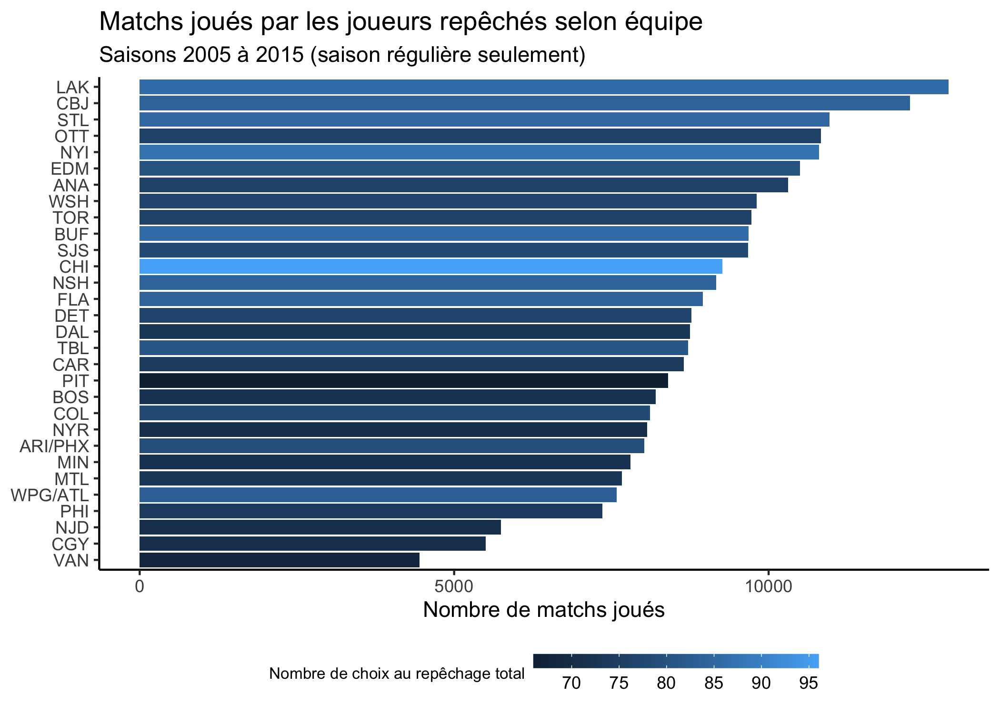
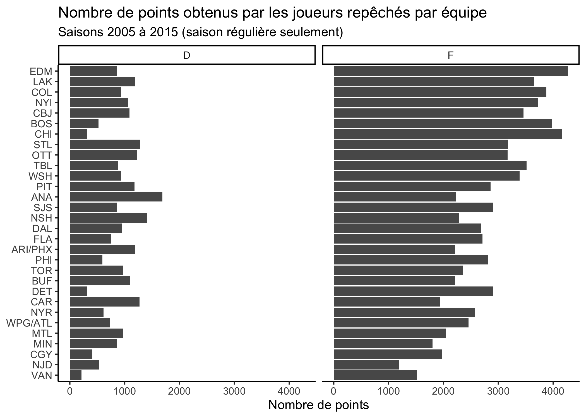
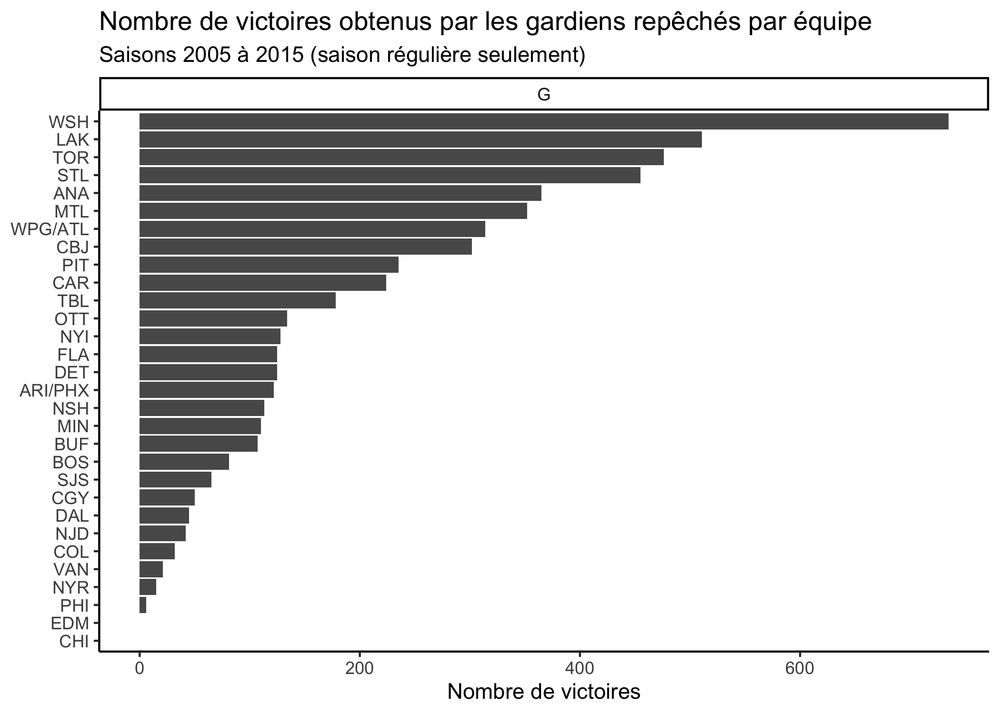
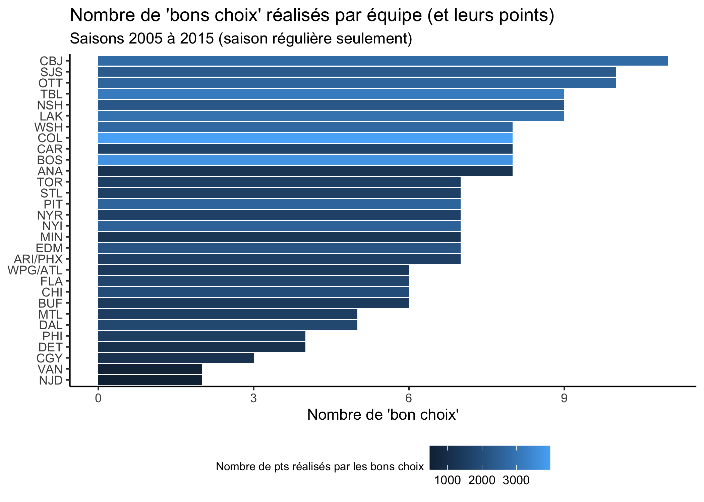

**On entend souvent dire que le repêchage de la LNH, tout comme c'est le cas
dans d'autres sports professionnels, est une science inexacte. J'imagine que cette
expression fait référence au fait que si l'on doit repêcher un joueur $x$ à un moment 
$t$ donné, il n'y a aucune certitude que ce joueur est le bon choix. Mais disons 
qu'on prend le temps de regarder plusieurs choix, sur plusieurs années, est-ce toujours le 
cas? Est-ce que le repêchage devient en quelque sorte une science plus "exacte" lorsque l'échantillon de joueurs repêchés devient plus grand?**

Dans cet article, je tenterai d'éclairer cette question en analysant les récents
repêchages de la LNH. Pour se faire, j'utiliserai différentes fonctionnalités du
_package_ <svg style="height:0.8em;top:.04em;position:relative;fill:steelblue;" viewBox="0 0 581 512"><path d="M581 226.6C581 119.1 450.9 32 290.5 32S0 119.1 0 226.6C0 322.4 103.3 402 239.4 418.1V480h99.1v-61.5c24.3-2.7 47.6-7.4 69.4-13.9L448 480h112l-67.4-113.7c54.5-35.4 88.4-84.9 88.4-139.7zm-466.8 14.5c0-73.5 98.9-133 220.8-133s211.9 40.7 211.9 133c0 50.1-26.5 85-70.3 106.4-2.4-1.6-4.7-2.9-6.4-3.7-10.2-5.2-27.8-10.5-27.8-10.5s86.6-6.4 86.6-92.7-90.6-87.9-90.6-87.9h-199V361c-74.1-21.5-125.2-67.1-125.2-119.9zm225.1 38.3v-55.6c57.8 0 87.8-6.8 87.8 27.3 0 36.5-38.2 28.3-87.8 28.3zm-.9 72.5H365c10.8 0 18.9 11.7 24 19.2-16.1 1.9-33 2.8-50.6 2.9v-22.1z"/></svg>
[`tidynhl`](https://jplecavalier.github.io/tidynhl/), un projet réalisé par [Jean-Philippe Le Cavalier](https://jplecavalier.rbind.io/fr/) (un bon ami à moi).

# Mise en contexte {#mise-en-contexte}

Pour commencer, je dois vous faire un aveu: je préfère regarder le repêchage de la 
LNH que la finale de la coupe Stanley elle-même. En tant qu'amateur de hockey, 
j'ai presque honte de l'avouer. J'adore analyser les futurs joueurs ainsi que les choix des équipes pendant cette séance de repêchage. Certes, il y aura toujours beaucoup d'incertitude autour de la sélection d'un joueur. Par contre, en tant que scientifique de données, je crois que cette incertitude peut être réduite par les experts et les dépisteurs les plus compétents, ceux qui savent bien évaluer les jeunes joueurs. La question à laquelle nous tenterons de répondre peut se formuler comme

> Est-ce que certaines équipes sont plus performantes que d'autres pour repêcher de futurs joueurs?

# Préparation des données {#preparation-donnees}

Pour tenter de répondre à cette question, j'ai décidé d'analyser les sélections des repêchages allant de 2005 à 2015. Ce choix est arbitraire et se base sur le fait que 10 ans me semble assez crédible comme échantillon de joueurs (près de 2500 joueurs repêchés). Aussi, pour éviter que les bons joueurs repêchés dans de mauvaises équipes soient trop pénalisés, nous allons nous restreindre aux statistiques en saison régulière. Cela permettra aux joueurs d'être comparés sur une base plus équitable, où toutes les équipes jouent le même nombre de matchs. La première étape consiste à importer les données associées à ces repêchages avec la fonction `tidy_drafts()`.
 

```r
# Charger les packages
library(data.table)
library(tidynhl)

# Définir les annees de repechages analysees
DRAFT_YEARS <- c(2005:2015)

# Obtenir les données de repêchage
dt_draft <- tidy_drafts(
  drafts_year = DRAFT_YEARS,
  keep_id = TRUE
)

# Enlever les choix sans joueurs (exceptionnels)
# Par exemple: NJ Devils perdu leur choix en 2011 (https://www.cbssports.com/nhl/news/devils-kovalchuk-penalty-reduced-get-first-round-pick-back/)
dt_draft <- dt_draft[!is.na(player_id),]

# On se crée une fonction pour fusionner les équipes déménagées (ou renommées)
# Nettoyage de données
merge_moved_teams <- function(dt) {
  
  dt[team_abbreviation %in% c("WPG", "ATL"), team_abbreviation := "WPG/ATL"]
  dt[team_abbreviation %in% c("PHX", "ARI"), team_abbreviation := "ARI/PHX"]
  
  dt
  
}

# Fusionner les équipes déménagés
dt_draft <- merge_moved_teams(dt_draft)

# Afficher un extrait des données
dt_draft[]
```

```
##       draft_year draft_round draft_pick draft_overall team_id team_abbreviation player_id      player_name amateur_league_name amateur_team_name
##    1:       2005           1          1             1       5               PIT   8471675    Sidney Crosby               QMJHL          Rimouski
##    2:       2005           1          2             2      24               ANA   8471676       Bobby Ryan                 OHL        Owen Sound
##    3:       2005           1          3             3      12               CAR   8471677     Jack Johnson                 USA          USA U-18
##    4:       2005           1          4             4      30               MIN   8471678   Benoit Pouliot                 OHL           Sudbury
##    5:       2005           1          5             5       8               MTL   8471679      Carey Price                 WHL          Tri-City
##   ---                                                                                                                                           
## 2334:       2015           7         26           207       8               MTL   8478921 Jeremiah Addison                 OHL            Ottawa
## 2335:       2015           7         27           208      22               EDM   8478922 Miroslav Svoboda           CZREP-JR.        Trinec Jr.
## 2336:       2015           7         28           209      22               EDM   8478923     Ziyat Paigin              RUSSIA             Kazan
## 2337:       2015           7         29           210      23               VAN   8478924       Tate Olson                 WHL     Prince George
## 2338:       2015           7         30           211      16               CHI   8478925   John Dahlstrom          SWEDEN-JR.      Frolunda Jr.
```

Afin d'avoir plus d'informations sur les joueurs, nous allons également importer des métadonnées (date de naissance, position, nationalité, etc.) sur ceux-ci grâce à la fonction `tidy_players_meta()`.


```r
# Obtenir les metadonnées sur les joueurs
dt_meta_player <- tidy_players_meta(
  players_id = unique(dt_draft$player_id), 
  keep_id = TRUE
)

# Fusionner les équipes déménagés
dt_meta_player <- merge_moved_teams(dt_meta_player)

dt_all <- merge(
  x = dt_draft,
  y = dt_meta_player[, c("player_id", "player_position_type")],
  by = c("player_id"),
  all.x = TRUE
)

# Afficher un extrait des métadonnées
dt_meta_player[]
```

```
##       player_id      player_name player_active player_roster_status player_number player_position player_position_type player_nationality player_birth_country player_birth_stateprovince player_birth_city player_birth_date player_dead player_death_date player_inches player_pounds player_hand player_rookie player_hof player_hof_year player_nhl_100 team_id team_abbreviation
##    1:   8470659   Masi Marjamaki         FALSE                    N            58               L                    F                FIN                  FIN                       <NA>              Pori        1985-01-16       FALSE              <NA>            74           184           L         FALSE      FALSE              NA          FALSE      NA              <NA>
##    2:   8470812     Dany Roussin         FALSE                    N            NA               L                    F                CAN                  CAN                         QC       Quebec City        1985-01-09       FALSE              <NA>            74           190           L         FALSE      FALSE              NA          FALSE      NA              <NA>
##    3:   8470817  William Colbert         FALSE                    N            52               D                    D                CAN                  CAN                         ON          Arnprior        1985-02-06       FALSE              <NA>            74           210           L         FALSE      FALSE              NA          FALSE      NA              <NA>
##    4:   8470872  Trevor Hendrikx         FALSE                    N            NA               D                    D                CAN                  CAN                         ON        Winchester        1985-03-29       FALSE              <NA>            74           200           R         FALSE      FALSE              NA          FALSE      NA              <NA>
##    5:   8470996     Danny Syvret         FALSE                    Y            26               D                    D                CAN                  CAN                         ON         Millgrove        1985-06-13       FALSE              <NA>            72           205           L         FALSE      FALSE              NA          FALSE      NA              <NA>
##   ---                                                                                                                                                                                                                                                                                                                                                                                
## 2328:   8478921 Jeremiah Addison         FALSE                    N            64               L                    F                CAN                  CAN                         ON          Brampton        1996-10-21       FALSE              <NA>            72           188           L          TRUE      FALSE              NA          FALSE      NA              <NA>
## 2329:   8478922 Miroslav Svoboda         FALSE                    N            39               G                    G                CZE                  CZE                       <NA>            Vsetin        1995-03-07       FALSE              <NA>            75           191           L          TRUE      FALSE              NA          FALSE      NA              <NA>
## 2330:   8478923     Ziyat Paigin         FALSE                    N            92               D                    D                RUS                  RUS                       <NA>             Penza        1995-02-08       FALSE              <NA>            78           210           L          TRUE      FALSE              NA          FALSE      NA              <NA>
## 2331:   8478924       Tate Olson         FALSE                    N            NA               D                    D                CAN                  CAN                         SK         Saskatoon        1997-03-21       FALSE              <NA>            74           174           L          TRUE      FALSE              NA          FALSE      NA              <NA>
## 2332:   8478925   John Dahlstrom         FALSE                    N            44               R                    F                SWE                  SWE                       <NA>        Kungsbacka        1997-01-22       FALSE              <NA>            72           189           L          TRUE      FALSE              NA          FALSE      NA              <NA>
```
 
Nous allons ensuite importer les statstiques individuelles de ces joueurs repêchés grâce aux fonctions `tidy_skaters_stats()` et `tidy_goalies_stats()`. 


```r
# Obtenir les données de statistiques individuelles des joueurs
dt_skaters_stats <- tidy_skaters_stats(
  players_id = unique(dt_all[player_position_type %in% c("F", "D")]$player_id),
  playoffs = FALSE,
  keep_id = TRUE
)

# Obtenir les données de statistiques individuelles des joueurs
dt_goalies_stats <- tidy_goalies_stats(
  players_id = unique(dt_all[player_position_type == "G"]$player_id),
  playoffs = FALSE,
  keep_id = TRUE
)

dt_stats <- rbindlist(list(dt_skaters_stats, dt_goalies_stats), 
                      use.names = TRUE, 
                      fill = TRUE)

# Afficher un extrait des données
dt_stats[]
```

```
##       player_id    player_name season_id season_years season_type team_id team_abbreviation skater_games skater_goals skater_assists skater_points skater_plusminus skater_pim skater_toi skater_shifts skater_gwg skater_otg skater_shots skater_blocked skater_hits skater_ev_goals skater_ev_assists skater_ev_points skater_ev_toi skater_pp_goals skater_pp_assists skater_pp_points skater_pp_toi skater_pk_goals skater_pk_assists skater_pk_points skater_pk_toi goalie_games goalie_started goalie_wins goalie_losses goalie_ties goalie_ot goalie_shutouts goalie_shotagainst goalie_goalagainst goalie_savepct goalie_gaa goalie_toi goalie_ev_shotagainst goalie_ev_goalagainst goalie_ev_savepct goalie_pp_shotagainst goalie_pp_goalagainst goalie_pp_savepct goalie_pk_shotagainst goalie_pk_goalagainst goalie_pk_savepct
##    1:   8470659 Masi Marjamaki  20052006      2005-06     regular       2               NYI            1            0              0             0                0          0   5.283333             7          0          0            0              0           1               0                 0                0      5.283333               0                 0                0      0.000000               0                 0                0      0.000000           NA             NA          NA            NA          NA        NA              NA                 NA                 NA             NA         NA         NA                    NA                    NA                NA                    NA                    NA                NA                    NA                    NA                NA
##    2:   8470996   Danny Syvret  20052006      2005-06     regular      22               EDM           10            0              0             0               -1          6 123.133333           166          0          0            8              8           1               0                 0                0     96.916667               0                 0                0     25.050000               0                 0                0      1.166667           NA             NA          NA            NA          NA        NA              NA                 NA                 NA             NA         NA         NA                    NA                    NA                NA                    NA                    NA                NA                    NA                    NA                NA
##    3:   8470996   Danny Syvret  20062007      2006-07     regular      22               EDM           16            0              1             1              -10          6 295.500000           373          0          0           15             25           1               0                 1                1    247.700000               0                 0                0     28.300000               0                 0                0     19.500000           NA             NA          NA            NA          NA        NA              NA                 NA                 NA             NA         NA         NA                    NA                    NA                NA                    NA                    NA                NA                    NA                    NA                NA
##    4:   8470996   Danny Syvret  20082009      2008-09     regular       4               PHI            2            0              0             0               -1          0  18.850000            27          0          0            0              1           1               0                 0                0     18.850000               0                 0                0      0.000000               0                 0                0      0.000000           NA             NA          NA            NA          NA        NA              NA                 NA                 NA             NA         NA         NA                    NA                    NA                NA                    NA                    NA                NA                    NA                    NA                NA
##    5:   8470996   Danny Syvret  20092010      2009-10     regular       4               PHI           21            2              2             4                1         12 262.050000           357          0          0           14             20           6               2                 2                4    257.516667               0                 0                0      2.583333               0                 0                0      1.950000           NA             NA          NA            NA          NA        NA              NA                 NA                 NA             NA         NA         NA                    NA                    NA                NA                    NA                    NA                NA                    NA                    NA                NA
##   ---                                                                                                                                                                                                                                                                                                                                                                                                                                                                                                                                                                                                                                                                                                                                                                                                                                    
## 6701:   8478492  Ilya Samsonov  20202021      2020-21     regular      15               WSH           NA           NA             NA            NA               NA         NA         NA            NA         NA         NA           NA             NA          NA              NA                NA               NA            NA              NA                NA               NA            NA              NA                NA               NA            NA            2              2           1             0           0         1               0                 53                  7      0.8679245   3.360000   125.0000                    43                     6         0.8604651                     8                     1         0.8750000                     2                     0                 1
## 6702:   8478499      Adin Hill  20172018      2017-18     regular      53               ARI           NA           NA             NA            NA               NA         NA         NA            NA         NA         NA           NA             NA          NA              NA                NA               NA            NA              NA                NA               NA            NA              NA                NA               NA            NA            4              4           1             3           0         0               0                129                 14      0.8914729   3.489097   240.7500                   118                    12         0.8983051                     9                     2         0.7777778                     2                     0                 1
## 6703:   8478499      Adin Hill  20182019      2018-19     regular      53               ARI           NA           NA             NA            NA               NA         NA         NA            NA         NA         NA           NA             NA          NA              NA                NA               NA            NA              NA                NA               NA            NA              NA                NA               NA            NA           13             11           7             5           0         0               1                322                 32      0.9006211   2.757234   696.3500                   271                    27         0.9003690                    41                     5         0.8780488                    10                     0                 1
## 6704:   8478499      Adin Hill  20192020      2019-20     regular      53               ARI           NA           NA             NA            NA               NA         NA         NA            NA         NA         NA           NA             NA          NA              NA                NA               NA            NA              NA                NA               NA            NA              NA                NA               NA            NA           13              9           2             4           0         3               0                343                 28      0.9183673   2.621859   640.7667                   284                    19         0.9330986                    45                     9         0.8000000                    14                     0                 1
## 6705:   8478916   Joey Daccord  20182019      2018-19     regular       9               OTT           NA           NA             NA            NA               NA         NA         NA            NA         NA         NA           NA             NA          NA              NA                NA               NA            NA              NA                NA               NA            NA              NA                NA               NA            NA            1              1           0             1           0         0               0                 40                  5      0.8750000   5.000000    60.0000                    35                     3         0.9142857                     3                     2         0.3333333                     2                     0                 1
```

Finalement, nous allons appliquer quelques transformations et manipulations à ces
trois jeux de données afin de régler quelques détails techniques importants pour l'analyse.


```r
# On se crée une fonction pour aggréger les données essentielles
# On va devoir aggréger plusieurs fois les memes stats (pts, games, wins) dans l'analyse
aggregate_stats <- function(dt, old_by_names, new_by_names) {
  
  dt_aggregated <- dt[, .(
    skater_points = sum(skater_points, na.rm = TRUE),
    skater_games = sum(skater_games, na.rm = TRUE),
    goalie_games = sum(goalie_games, na.rm = TRUE),
    goalie_wins = sum(goalie_wins, na.rm = TRUE)
  ), old_by_names]
  
  # On additionne les games des goalies et des players car stockés dans 2 variables différentes
  dt_aggregated[, player_games := ifelse(is.na(skater_games), 0, skater_games) + ifelse(is.na(goalie_games), 0, goalie_games)]
  setnames(dt_aggregated, old_by_names, new_by_names)
  
}

# Fusionner les équipes déménagés
dt_stats <- merge_moved_teams(dt_stats)

# Aggrégé les données par équipe jouée et joindre les données
dt_stats_aggregated <- aggregate_stats(
  dt = dt_stats,
  old_by_names = c("player_id", "team_abbreviation"), 
  new_by_names = c("player_id", "team_played")
)

dt_all <- merge(
  x = dt_all,
  y = dt_stats_aggregated,
  by = c("player_id"),
  all.x = TRUE
)
setnames(dt_all, old = "team_abbreviation", new = "team_drafted")

# Afficher un extrait des données pour un joueur
dt_all[player_name == "P.K. Subban",]
```

```
##    player_id draft_year draft_round draft_pick draft_overall team_id team_drafted player_name amateur_league_name amateur_team_name player_position_type team_played skater_points skater_games goalie_games goalie_wins player_games
## 1:   8474056       2007           2         13            43       8          MTL P.K. Subban                 OHL        Belleville                    D         MTL           278          434            0           0          434
## 2:   8474056       2007           2         13            43       8          MTL P.K. Subban                 OHL        Belleville                    D         NSH           130          211            0           0          211
## 3:   8474056       2007           2         13            43       8          MTL P.K. Subban                 OHL        Belleville                    D         NJD            21           77            0           0           77
```

Maintenant que nous avons structuré les données dans un format étant plus facile à
manipuler, nous allons tenter d'aggréger celles-ci de différentes manières afin
d'avoir un portrait par équipe. Allons-y ! 

<center>


</center>

# Les équipes repêchent-elles autant? {#nombre-de-choix}

Dans un premier temps, on est en droit de se poser la question: est-ce que toutes
les équipes de la LNH repêchent autant de joueurs? Sachant que chaque équipe
possède un choix dans chacune des rondes du repêchage, on pourrait penser que 
oui. Par contre, on sait très bien que les équipes peuvent échanger leurs choix
afin d'obtenir des joueurs ou d'autres choix. Ainsi, j'étais curieux
de voir comment était distribué ce nombre de choix "réels" parmi les équipes. Pour 
commencer, nous allons aggréger certaines informations par équipe.


```r
# Aggréger les données des jouers par équipes repêchés
dt_per_team <- dt_all[, .(
  nb_picks = uniqueN(.SD[]$player_id), 
  nb_1st_round_picks = uniqueN(.SD[draft_round == 1]$player_id),
  nb_games_played = sum(player_games, na.rm = TRUE),
  nb_points = sum(skater_points, na.rm = TRUE),
  nb_wins = sum(goalie_wins, na.rm = TRUE)
  ), .(team_drafted)]

# Afficher un extrait
head(dt_per_team[])
```

```
##    team_drafted nb_picks nb_1st_round_picks nb_games_played nb_points nb_wins
## 1:          NYI       87                 14           10804      4785     128
## 2:          LAK       86                 10           12863      4834     511
## 3:          SJS       78                  9            9672      3754      65
## 4:          CBJ       84                 13           12250      4542     302
## 5:          EDM       80                 13           10502      5129       0
## 6:          NYR       71                  8            8072      3193      15
```

Maintenant que nous avons les données aggrégées par équipe, nous pouvons
visualiser le nombre de joueurs repêchés grâce au _package_ [`ggplot2`](https://ggplot2.tidyverse.org). En bonus, on peut également voir le 
nombre de joueurs repêchés en **première ronde** (points rouges).


```r
library(ggplot2)

ggplot(
  data = dt_per_team,
  mapping = aes(
    x = nb_picks,
    y = reorder(as.factor(team_drafted), nb_picks), 
  )
) +
  geom_col() +
  geom_point(
    mapping = aes(
      x = nb_1st_round_picks,
      color = " "
    )
  ) +
  scale_color_manual(
    name = "Nombre de joueurs choisi en 1er ronde", 
    values = c(" " = "red") 
  ) +
  labs(
    title = "Nombre de joueurs repêchés par équipe",
    subtitle = "Saisons 2005 à 2015",
    x = "Nombre de joueurs "
  )
```

<!-- -->

On peut conclure que le nombre de joueurs repêchés par équipe n'est clairement pas
uniforme (écart de 30 choix entre la première et la dernière équipe). On pourrait également dire la même chose pour les choix de premières rondes (écart de 9 choix).

# Qui repêche "bien"?

Tentons maintenant d'analyser des mesures qui nous permettront de conclure qu'une
équipe semble repêcher de bons joueurs, et ce, sur une assez longue période de temps
(en occurence 10 ans ici). Gardons bien en tête l'aspect relatif entre les équipes, car
l'objectif demeure de voir si certaines équipes sont plus performantes que les autres.

## Les matchs joués dans la _Grande Ligue_ {#match-joues}

Comment savoir si une équipe repêche de bons joueurs? La première idée 
qui me vient en tête est évidemment de regarder le nombre de matchs joué dans la LNH. Cette mesure est en quelque sorte indépendante de la position ou du style de joueur, ce qui rend son interprétation plus simple. Par contre, n'oublions pas que certaines équipes ont repêchés plus de
joueurs que d'autres. Dans le graphique ci-dessous, si la logique du nombre de choix était respectée, les barres seraient ordonnées de la plus pâle vers la plus foncée (en partant d'en haut).


```r
ggplot(
  data = dt_per_team, 
  mapping = aes(
    y = reorder(as.factor(team_drafted), nb_games_played), 
    x = nb_games_played,
    fill = nb_picks
  )
) +
  geom_col() +
  scale_fill_continuous("Nombre de choix au repêchage total") +
  guides(fill = guide_colourbar(barwidth = 10, barheight = 0.5)) +
  labs(
    title = "Matchs joués par les joueurs repêchés selon équipe",
    subtitle = "Saisons 2005 à 2015 (saison régulière seulement)",
    x = "Nombre de matchs joués"
  )
```

<!-- -->

Je vous laisse tirer vos propres conclusions, mais de mon côté je remarque que les Blackhawks de Chicago semblent avoir peu de matchs joués pour le nombre de choix "réels".

## Les buts 🚨 et les passes 🍎 récoltés

Une autre mesure évidente à analyser est le nombre de points ($buts + passes$) obtenus par les joueurs repêchés par une équipe. Contrairement aux matchs joués, il faut tenir compte de la position du joueur dans ce cas-ci. Les attaquants font en général plus de points que les défenseurs, et peut-être que certaines équipes repêchent plus de défenseurs, ou même de gardiens (attendez ça s'en vient) ...


```r
library(dplyr)

dt_stats_position <- aggregate_stats(
  dt = dt_all,
  old_by_names = c("team_drafted", "player_position_type"),
  new_by_names = c("team_drafted", "player_position_type")
)
dt_stats_position <- merge(dt_stats_position, dt_per_team[, c("team_drafted", "nb_points")], by = "team_drafted", all.x = TRUE)

dt_stats_position[player_position_type %in% c("F", "D"),] %>%
  ggplot(
    mapping = aes(
      x = skater_points,
      y = reorder(as.factor(team_drafted), nb_points),
      group = player_position_type
    )
  ) +
    geom_col() +
    facet_grid(. ~ player_position_type) +
    theme_classic() +
    theme(axis.title.y = element_blank(),
          legend.position = "bottom") +
    labs(
      title = "Nombre de points obtenus par les joueurs repêchés par équipe",
      subtitle = "Saisons 2005 à 2015 (saison régulière seulement)",
      x = "Nombre de points"
    )
```

<!-- -->

Dans le graphique ci-dessus, les équipes sont ordonnées selon le nombre de points combiné entre les attaquants (F) et les défenseurs (D). On peut donc conclure que les Oilers d'Edmonton est l'équipe qui a repêché, entre 2005 et 2015, les joueurs ayant récoltés le plus de points dans la LNH (merci à la lotterie). Dans ce graphique, on peut également voir que les Ducks d'Anaheim et les Predators de Nashville semblent avoir repêchés de bons défenseurs, probablement au détriment de repêcher de bons attaquants. Voici les 5 défenseurs les plus productifs repêchés par ces 2 équipes:


```r
unique(dt_all[team_drafted == "ANA" & player_position_type == "D",][order(-skater_points)]$player_name)[1:5]
```

```
## [1] "Cam Fowler"      "Jake Gardiner"   "Hampus Lindholm" "Sami Vatanen"    "Shea Theodore"
```

```r
unique(dt_all[team_drafted == "NSH" & player_position_type == "D",][order(-skater_points)]$player_name)[1:5]
```

```
## [1] "Roman Josi"     "Ryan Ellis"     "Seth Jones"     "Mattias Ekholm" "Cody Franson"
```

Pas mal 😮!

## Nos amis les gardiens

Maintenant que nous avons regardé les attaquants et les défenseurs, jetons un coup d'oeil aux gardiens de but. Comme mesure alternative au nombre de points, j'ai utilisé le nombre de victoires.


```r
aggregate_stats(
  dt = dt_all,
  old_by_names = c("team_drafted", "player_position_type"),
  new_by_names = c("team_drafted", "player_position_type")
)[player_position_type == "G",] %>%
  ggplot(
    mapping = aes(
      x = goalie_wins,
      y = reorder(as.factor(team_drafted), goalie_wins),
      group = player_position_type
    )
  ) +
    geom_col() +
    facet_grid(. ~ player_position_type) +
    theme_classic() +
    theme(axis.title.y = element_blank(),
          legend.position = "bottom") +
    labs(
      title = "Nombre de victoires obtenus par les gardiens repêchés par équipe",
      subtitle = "Saisons 2005 à 2015 (saison régulière seulement)",
      x = "Nombre de victoires"
    )
```

<!-- -->

Pour ceux qui pensaient que Carey Price permettrait au Canadiens d'être au premier rang, vous étiez trop ambitieux. Par contre, peut-être qu'ils auraient eu plus de chances si j'avais inclus le repêchage de 2003, séance où fut repeché un certain Jaroslav Halak. On peut remarquer que les Capitals de Washington semblent avoir eu du flair pour repêcher de bons gardiens de buts. Seriez-vous capable de nommer quelques uns de ces gardiens?


```r
unique(dt_all[team_drafted == "WSH" & player_position_type == "G",][order(-goalie_wins)]$player_name)[1:5]
```

```
## [1] "Braden Holtby"    "Semyon Varlamov"  "Michal Neuvirth"  "Philipp Grubauer" "Ilya Samsonov"
```

Connaissant les problèmes de gardiens de but qu'on connu les Maple Leafs de Toronto, il est suprenant de les voir au 3ème rang. Toutefois, ils auraient peut-être mieux fait de conserver Tukka Rask dans leurs rangs ... Encore une fois, on ne peut pas dire que les Blackhawks ont eu beaucoup de succès avec leurs gardiens repêchés sur cette période.

# Trouver le bon joueur {#trouver-bon-joueur}

Maintenant que nous avons un premier portrait de la performance des équipes au repêchage, je veux valider une dernière chose. Je veux voir si certaines équipes ont tendance à faire plus souvent le "bon choix" que d'autres. Pour évaluer si une équipe fait le "bon choix", j'ai mis en place un petit algorithme. Cet algorithme peut s'expliquer comme suit: je regarde pour un choix donné, les choix subséquents et je valide qu'aucun joueur repêché après ce choix n'a fait plus de points. Pour les gardiens, je regarde le nombre de victoires. Pour paufiner cette approche, j'ai fais quelques hypothèses additionnelles:


```r
JOUEURS_FENETRE <- 20
JOUEURS_MIN_PTS <- 100
JOUEURS_GARDIENS_INTERVAL <- 0.95
GARDIENS_MIN_WINS <- 50
```

- Je regarde uniquement les **20** choix subséquents à un choix donné. Cela évite qu'une perle rare repêchée en fin de repêchage, disons Pavel Datsyuk, fasse passer tous les autres choix pour de "mauvais choix".
- Je vérifie que le joueur a fait un minimum de points, j'ai fixé ce minimum à **100** points.
- Je donne le bénéfice du doute à un joueur ayant presque fait le même nombre de points qu'un autre dans la fenêtre de **20** choix. Pour rendre cela possible, je considère toujours comme un "bon choix" un joueur qui a fait au moins **95%** du nombre de points qu'un autre joueur dans la fenêtre.
- Je compare les attaquants avec les attaquants et les défenseurs avec les défenseurs.
- En raison du plus petit nombre de gardiens repêchés, je ne considère pas de fenêtre pour cette position. Ainsi, pour qu'un gardien soit considéré comme un "bon choix", il doit avoir récolté plus de victoires que tous les gardiens repêchés après.
- Je donne également le bénéfice du doute aux gardiens, j'applique encore une fois un ratio de **95%** sur le nombre de victoires.
- Les gardiens doivent avoir récoltés au moins **50** victoires pour être considérés comme un "bon choix".

Ces décisions un peu arbitraires sont basées sur mon jugement personnel. Je vous laisse le soin de changer certains de ces paramètres comme bon vous semble. Maintenant, voici la fonction qui nous permettra de tester notre approche.


```r
define_good_choice <- function(dt, player_window, player_min_pts, goalie_min_wins, interval) {
  
  dt[, good_pick := NA]

  for (row in seq_len(nrow(dt))) {
  
    # On stock les informations sur le choix à valider
    draft_year_temp <- dt[row,]$draft_year
    draft_pick_temp <- dt[row,]$draft_overall
    draft_position_temp <- dt[row,]$player_position_type
    draft_nb_points_temp <- dt[row,]$skater_points
    draft_wins_temp <- dt[row,]$goalie_wins
  
    if (draft_position_temp %in% c("F", "D")) {
  
      # On filtre les joueurs repêchés dans la fenêtre
      dt_temp <- dt[draft_year == draft_year_temp & player_position_type == draft_position_temp & draft_overall <= (draft_pick_temp + player_window) & draft_overall > draft_pick_temp,]
      
      # On calcule le nombre de points maximal dans la fenetre
      max_pts_windows <- max(dt_temp$skater_points, na.rm = TRUE)
      
      # Si manquant, on remplace par 0
      max_pts_windows <- ifelse(is.na(max_pts_windows), 0, max_pts_windows)
      draft_nb_points_temp <- ifelse(is.na(draft_nb_points_temp), 0, draft_nb_points_temp)
  
      if (draft_nb_points_temp > (max_pts_windows * interval) & draft_nb_points_temp >= player_min_pts) {
        dt[row,]$good_pick <- TRUE
      } else {
        dt[row,]$good_pick <- FALSE
      }
  
    } else if (draft_position_temp == "G") {
  
      # Aucune fenetre pour les gardiens
      dt_temp <- dt[draft_year == draft_year_temp & player_position_type == draft_position_temp & draft_overall > draft_pick_temp,]
      
      # On calcule le nombre de victoires maximal après le choix
      max_win_windows <- max(dt_temp$goalie_wins, na.rm = TRUE)
      
      # Si manquant, on remplace par 0
      max_win_windows <- ifelse(is.na(max_win_windows), 0, max_win_windows)
      draft_wins_temp <- ifelse(is.na(draft_wins_temp), 0, draft_wins_temp)
  
      if (draft_wins_temp > (max_win_windows * interval) & draft_wins_temp >= goalie_min_wins) {
        dt[row,]$good_pick <- TRUE
      } else {
        dt[row,]$good_pick <- FALSE
      }
  
    }
  
  }
  
  return(dt)
  
}
```

Afin de valider que notre approche se comporte bel et bien comme souhaité, on peut jeter un apperçu aux 30 premiers choix du repêchage du 2005 et interpréter la colonne `good_pick`.


```r
new_draft_aggregation = aggregate_stats(
  dt = dt_all,
  old_by_names = c("player_id", "draft_year", "draft_overall", "player_name", "team_drafted", "player_position_type"),
  new_by_names = c("player_id", "draft_year", "draft_overall", "player_name", "team_drafted", "player_position_type")
)

dt_good_picks <- define_good_choice(
  dt = new_draft_aggregation,
  player_window = JOUEURS_FENETRE,
  player_min_pts = JOUEURS_MIN_PTS,
  goalie_min_wins = GARDIENS_MIN_WINS,
  interval = JOUEURS_GARDIENS_INTERVAL
)

# Apercu des 30 premiers choix du repechage de 2005
dt_good_picks[draft_year == 2005,][order(draft_overall),][1:30, c("draft_year", "draft_overall", "team_drafted", "player_name", "player_position_type", "skater_points", "goalie_wins", "good_pick")]
```

```
##     draft_year draft_overall team_drafted      player_name player_position_type skater_points goalie_wins good_pick
##  1:       2005             1          PIT    Sidney Crosby                    F          1272           0      TRUE
##  2:       2005             2          ANA       Bobby Ryan                    F           562           0     FALSE
##  3:       2005             3          CAR     Jack Johnson                    D           302           0      TRUE
##  4:       2005             4          MIN   Benoit Pouliot                    F           263           0     FALSE
##  5:       2005             5          MTL      Carey Price                    G             0         352      TRUE
##  6:       2005             6          CBJ    Gilbert Brule                    F            95           0     FALSE
##  7:       2005             7          CHI      Jack Skille                    F            96           0     FALSE
##  8:       2005             8          SJS  Devin Setoguchi                    F           261           0     FALSE
##  9:       2005             9          OTT        Brian Lee                    D            36           0     FALSE
## 10:       2005            10          VAN      Luc Bourdon                    D             2           0     FALSE
## 11:       2005            11          LAK     Anze Kopitar                    F           965           0      TRUE
## 12:       2005            12          NYR       Marc Staal                    D           191           0     FALSE
## 13:       2005            13          BUF   Marek Zagrapan                    F             0           0     FALSE
## 14:       2005            14          WSH    Sasha Pokulok                    D             0           0     FALSE
## 15:       2005            15          NYI     Ryan O'Marra                    F             7           0     FALSE
## 16:       2005            16      WPG/ATL     Alex Bourret                    F             0           0     FALSE
## 17:       2005            17      ARI/PHX    Martin Hanzal                    F           338           0     FALSE
## 18:       2005            18          NSH      Ryan Parent                    D             7           0     FALSE
## 19:       2005            19          DET      Jakub Kindl                    D            87           0     FALSE
## 20:       2005            20          FLA  Kenndal McArdle                    F             3           0     FALSE
## 21:       2005            21          TOR      Tuukka Rask                    G             0         297     FALSE
## 22:       2005            22          BOS     Matt Lashoff                    D            16           0     FALSE
## 23:       2005            23          NJD  Niclas Bergfors                    F            83           0     FALSE
## 24:       2005            24          STL       T.J. Oshie                    F           574           0     FALSE
## 25:       2005            25          EDM  Andrew Cogliano                    F           425           0     FALSE
## 26:       2005            26          CGY      Matt Pelech                    F             4           0     FALSE
## 27:       2005            27          WSH       Joe Finley                    D             1           0     FALSE
## 28:       2005            28          DAL    Matt Niskanen                    D           356           0      TRUE
## 29:       2005            29          PHI     Steve Downie                    F           196           0     FALSE
## 30:       2005            30          TBL Vladimir Mihalik                    D             3           0     FALSE
##     draft_year draft_overall team_drafted      player_name player_position_type skater_points goalie_wins good_pick
```

À partir de cet apperçu, on peut voir que notre approche n'est pas parfaite, mais nous donne quand même une bonne idée de quels joueurs ont été de "bons choix". Sidney Crosby apparait comme un "bon choix" (fiouuu). On pourrait débattre que Bobby Ryan est un "bon choix", mais Anze Kopitar ne serait pas d'accord 😉. Si vous vous demandez pour TJ Oshie, il a été doublé par Paul Stastny en 2ème ronde. Est-ce que je considère Paul Stastny meilleur que TJ Oshie, pas nécéssairement, mais forcé d'admettre que le premier a fait près de 200 points de plus que le second.

Maintenant, voyons voir quelles équipes ont réalisé le plus grand nombre de "bons choix" selon l'approche que nous proposons. Puisque certains "bons choix" pourraient être considérés meilleurs que d'autres "bons choix", j'ai pris le soin d'ajouter le nombre de points réalisés par ces joueurs dans le graphique ci-dessous.


```r
ggplot(
  data = dt_good_picks[!is.na(good_pick), .(count = .N, nb_points = sum(skater_points, na.rm = T)), .(team_drafted, good_pick)][good_pick == TRUE], 
  mapping = aes(
    x = count, 
    y = reorder(as.factor(team_drafted), count),
    fill = nb_points
  )
) +
  geom_col() +
  scale_fill_continuous("Nombre de pts réalisés par les bons choix") +
  labs(
    title = "Nombre de 'bons choix' réalisés par équipe (et leurs points)",
    subtitle = "Saisons 2005 à 2015 (saison régulière seulement)",
    x = "Nombre de 'bon choix'"
  )
```

<!-- -->

On peut voir que certaines équipes ont eu plus de flair que d'autres. Les Blue Jackets de Columbus semblent se démarquer, regardons leurs "bons choix":


```r
columns_show <- c("draft_year", "draft_overall", "player_name", "skater_points", "goalie_wins")

# Bons choix des Blue Jackets
dt_good_picks[good_pick == TRUE & team_drafted == "CBJ", (columns_show), with = F]
```

```
##     draft_year draft_overall        player_name skater_points goalie_wins
##  1:       2005            67       Kris Russell           237           0
##  2:       2006           189      Derek Dorsett           127           0
##  3:       2006            69        Steve Mason             0         205
##  4:       2007             7      Jakub Voracek           753           0
##  5:       2008           127       Matt Calvert           201           0
##  6:       2008           157       Cam Atkinson           374           0
##  7:       2009            21         John Moore           115           0
##  8:       2010             4      Ryan Johansen           446           0
##  9:       2013            89 Oliver Bjorkstrand           144           0
## 10:       2013            14      Alex Wennberg           205           0
## 11:       2015             8      Zach Werenski           173           0
```

Il y a quand même quelques bons choix. Par contre, certains de ces joueurs ont peut-être profiter des failles de notre approche (Derek Dorsett ou John Moore par exemple). Je suis curieux de jeter un coup d'oeil à l'Avalanche du Colorado, qui ont realisé un peu moins de "bons choix".


```r
# Bons choix de l'Avalanche
dt_good_picks[good_pick == TRUE & team_drafted == "COL", (columns_show), with = F]
```

```
##    draft_year draft_overall       player_name skater_points goalie_wins
## 1:       2005            44      Paul Stastny           756           0
## 2:       2007            14 Kevin Shattenkirk           387           0
## 3:       2009            33     Ryan O'Reilly           572           0
## 4:       2009             3      Matt Duchene           638           0
## 5:       2009            64      Tyson Barrie           357           0
## 6:       2011             2 Gabriel Landeskog           485           0
## 7:       2013             1  Nathan MacKinnon           509           0
## 8:       2015            10    Mikko Rantanen           260           0
```

Un peu moins de "bons choix" que les Blue Jackets, mais ceux-ci semblent avoir eu un impact bien plus grand. On peut dire que l'Avalanche a su profiter de leurs hauts choix au repêchage ...

Finalement, aviez-vous réussi à deviner quels étaient les 5 "bons choix" de notre Sainte-Flanelle? 


```r
# Bons choix des Canadiens
dt_good_picks[good_pick == TRUE & team_drafted == "MTL", (columns_show), with = F]
```

```
##    draft_year draft_overall       player_name skater_points goalie_wins
## 1:       2005             5       Carey Price             0         352
## 2:       2005           200  Sergei Kostitsyn           176           0
## 3:       2007            43       P.K. Subban           429           0
## 4:       2007            22    Max Pacioretty           565           0
## 5:       2010           147 Brendan Gallagher           341           0
```

Pas trop mal, mais sur 10 années de repêchages, on aurait bien aimé avoir quelques "bons choix" de plus (surtout en première ronde) ...

<center>


</center>

# Conclusion {#conclusion}

Pour conclure cet article, je dois vous avouez que je continu de croire que le repêchage est une science inexacte. Il est difficile de tirer des conclusions évidentes étant donné les nombreuses composantes à prendre en compte. Sans entrer trop dans les détails, il y a le nombre de choix et les positions des joueurs repêchés. Certains joueurs font moins de points, mais apportent une composante de plus à une équipe, comme le leadership ou même l'aspect défensif. Toutefois, selon mes analyses, voici les équipes que je considère comme les grands "gagnants" et "perdants" ainsi que pourquoi.

## Les grands "gagnants" 👍

- **Avalanche du Colorodo:** On peut voir leurs "bon choix" plus haut. Ils ont bien saisis leur chance sur leurs choix de 1ère ronde, considérant qu'ils en ont eu que 9 alors que la moyenne de la ligue se situe à 11.
- **Bruins de Boston**: Arrivant au 26ème rang pour le nombre de choix, ils sont pourtant au 6ème rang pour les points récoltés par les joueurs repêchés. Ils sont également dans le premier tier pour le nombre de "bons choix".
- **Penguins de Pittsburg**: Arrivent au dernier rang dans la ligue pour le nombre de choix au total (avec 66 choix), ils ont fait une bonne utilisation de leurs choix. On peut les voir assez haut pour les points récoltés (12ème rang) et pour les victores des gardiens (9ème rang).
- **Kings de Los Angeles**: Certes, ils ont eu beaucoup de choix au total (86), mais ils ont su répondre à l'appel dans la majorité des facettes: matchs (1er rang), points (2ème rang) et victoires des gardiens (2ème rang).

### Les grands "perdants" 👎

- **Sabres de Buffalo**: Ils sont au 5ème rang pour le nombre de choix au toal, (dont 13 en 1ère ronde), mais ils arrivent relativement loin dans le classement pour le nombre de points récoltés (21ème rang) ou pour les victoires des gardiens (19ème rang). Ils sont également en bas de peloton pour le nombre de "bons choix". 
- **Jets de Winnipeg (et Atlanta)**: Ils sont au-dessus de la moyenne pour le nombre de choix total (83) et nombre de choix de première ronde (12). Ils se retrouvent en bas de classement pour la majorité des métriques: matchs (26ème rang), points (25ème rang). Seul point positif, les gardiens.
- **Canucks de Vancouver**: Même s'ils ont eu peu de choix au total (68), ils n'ont pas su tirer leur épingle du jeu, et ce, dans aucune catégorie. Avec 12 choix de 1ère ronde, versus une moyenne de 11 dans la ligue, on aurait pu s'attendre à de meilleures performances. Le nombre de matchs joués par leurs joueurs repêchés est catastrophique ...
- **Coyotes de l'Arizona (et Phoenix)**: On ne peut pas dire que leurs performances au repêchage est  "désastreuse", mais étant l'équipe avec le plus de choix de premières rondes (16), je me serais attendu à mieux.


Mention honorable pour les "mal-aimés" Oilers d'Edmonton. Ils ont certainement eu beaucoup de choix "faciles", mais ils arrivent quand même au premier rang pour le nombre de points.

