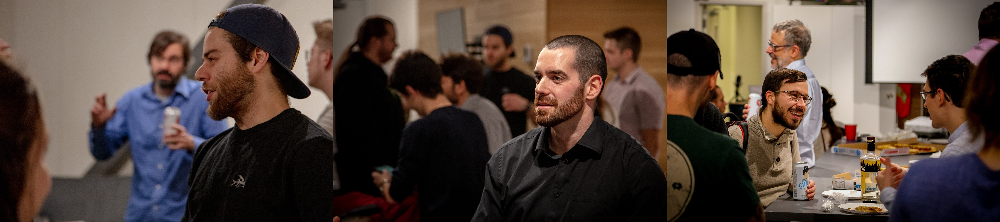

Ce n'est une surprise pour personne, 2020 a été une année différente pour .Layer. Elle fut néanmoins une année assez remplie. Voici donc un petit *recap* pour la communauté. Comme on dit, "vaux mieux tard que jamais"!

# Administration de l'organisme sans but lucratif (OSBL) 
La crise planétaire de 2020 ne nous a pas empêché de tenir notre assemblée générale annuelle (AGA) dans un format en ligne. Durant l'AGA, plusieurs points importants ont été discutés, tels que la charte, le bilan financier, les projets en cours et futurs, et surtout la notion de membre actif.

Ce dernier point, celui des membres actifs, était sans aucun doute le dernier morceau à mettre en place pour finaliser la structure de l'OSBL. Deux éléments motivent cette initiative : (1) couvrir les frais annuels liés à l'OSBL et (2) fournir un petit coussin pour les imprévus. En devenant membre membre actif, un individu obtiendra les avantages suivants :

- le droit de vote en assemblée lors de l'élection des administrateurs;
- la priorité de réservation pour les événements .Layer;
- _Bragger_ que tu supportes les activités d'une OSBL en science des données (de loin le plus cool de la liste).

Une dizaine de personnes ont effectué les démarches pour devenir membres actifs (voir la liste [ici](https://github.com/dot-layer/charte-osbl/blob/master/LISTEMEMBRES.md)). Il est possible de s'y joindre en suivant cette [procédure](https://github.com/dot-layer/charte-osbl/blob/master/DEVENIRMEMBRE.md) qui se résume essentiellement à écrire à `david.beauchemin.5@ulaval.ca` et à faire un virement interac de 20$ au trésorier (JTBai). 

# Comité blogue
Le comité blogue a connu une bonne première année d'existence.  Ils ont supervisé la publication de 9 articles en 2020. Plusieurs améliorations esthétiques ont aussi été mises en place par le comité et surtout par [Annie Deshaies](https://github.com/AnnieDeshaies) (merci Annie, for real merci!).

On rappelle que le blogue est lieu de publication pour toutes sortes d’articles : français, anglais, vulgarisation de concepts (apprentissage machine, programmation, science des données, statistiques, etc.), expérience personnelle, présentation d’un projet, *name it*! Ne soyez pas timide. En parlant de ces fameux articles, en voici la liste :

- [Training a Recurrent Neural Network (RNN) using PyTorch](https://www.dotlayer.org/en/blog/2020-08-19-train-a-sequence-model-with-poutyne/machine-learning/)
- [Reproductibilité en apprentissage automatique](https://www.dotlayer.org/blog/2020-10-30-reproducibility-in-ml-a-talk/machine-learning/)
- [OpenLayer, 1 an plus tard](https://www.dotlayer.org/blog/2020-07-29-openlayer-one-year/podcast/)
- [Kobenhavn](https://www.dotlayer.org/blog/2020-06-09/copenhagen/)
- [Comment proposer un article](https://www.dotlayer.org/blog/2020-03-19-howto/howto-fr/)
- [Boosting Trees avec Julia](https://www.dotlayer.org/blog/2020-01-04-julia-boosting-trees/julia-boosting-trees/)
- [What's wrong with scikit-learn](https://www.dotlayer.org/en/blog/2020-03-04-what-is-wrong-with-sklearn/neat-machine-learning-pipelines/)
- [Recap 2019](https://www.dotlayer.org/blog/2019-12-19-recap-2019/recap-2019/)
- [Argparse: un outil méconnu](https://www.dotlayer.org/blog/2019-05-21-argparse-package/optparse-package/)

## Projets futurs
Pour 2021, le comité vise un plus grand nombre de publications, soit une douzaine. De plus, cela fait [un moment](https://github.com/dot-layer/blog/issues/14) que nous parlons d'ajouter une bibliothèque de critiques (reviews) de livre, en espérant que cette année sera la bonne! Finalement, nous avons décidé d'ajouter une section [nos membres](https://github.com/dot-layer/blog/issues/112) afin de remercier les membres actifs qui supportent l'initiative. Bien sûr, si vous avez des idées d'améliorations vos suggestions sont très appréciées. Pour ce faire, la meilleure façon est de créer une [issue](https://github.com/dot-layer/blog/issues) sur le dépôt du blogue.

# OpenLayer
En 2019, [David Beauchemin](https://github.com/davebulaval) a introduit [OpenLayer](https://anchor.fm/open-layer), un podcast sur l'IA et l'apprentissage machine. Puisque la formule est en présentiel, le nombre d'épisodes publié a été plus bas que ce qui était prévu (27 de moins que prévu), soit 13 pour un total de 32 épisodes total. Toutefois, la formule a connu un grand succès avec pas loin de 5 000 vues sur YouTube et 2 000 sur les autres réseaux de diffusion (c.-à-d. Spotify et iTunes). Cette pause forcée a permis toutefois d'améliorer l'esthétique du podcast avec l'ajout de _thumbnails_, l'amélioration des messages de diffusion et le peaufinage de l'image. 

## Vision future
Pour 2021, puisque la situation ne s'améliore pas et que la formule *en personne* habituelle n'est pas encore possible, une série _spéciale_ en ligne, en anglais, commence à être mise sur pied. L'idée est de "profiter" de l'impossibilité d'être en personne pour échanger avec des gens de l'extérieur du Québec.
# Meetup Machine Learning Québec

Crédit photo : Can-Explore

En 2019, nous écrivions : "2020 s'annonce tout aussi occupée [que 2019] avec un meetup déjà *in the making*. On vise aussi à incorporer plus de formules 5@7 et potentiellement un hackaton."

_I guess not!_

Finalement, nous avons _**seulement**_ eu droit à un évènement meetup, le 12 février chez Can-Explore. L'évènement fut un grand succès avec une cinquantaine de personnes (le bon vieux temps quoi). La gang de Meetup ML a décidé de ne pas organiser d'évènement en ligne puisque la formule originale est très axée sur les échanges pendant et après les présentations; l'évènement en ligne nous semblait dénaturé. Nous avons préféré concentrer nos efforts sur autre chose : nos 10 autres projets. Nous restons bien sûr à l'affut de tout changement et espérons organiser meetup vers la fin de 2021.

# Stage sur le projet Universal Data Tool.
Pour 2020, nous avons eu un stagiaire en programmation durant 5 semaines. Il a travaillé sur le développement de fonctionnalité pour l'outil d'annotation de données [Universal Data Tool](https://universaldatatool.com/).Son travail a permis l'intégration de [plusieurs fonctionnalités](https://github.com/UniversalDataTool/universal-data-tool/issues?q=CedricJean) tel que la [gestion Cognito S3](https://github.com/UniversalDataTool/universal-data-tool/pull/103).

Mentionnons [Marc-Alexandre Paquet](https://github.com/Ownmarc) qui a eu (1) l'idée et (2) qui a fortement contribué à la supervision du stagiaire durant son stage.

# Conclusion
Ça y est, c'est la fin du _recap_ de l'année 2020. On se souhaite une (autre) bonne année!

Sam Peroche et David Beauchemin
